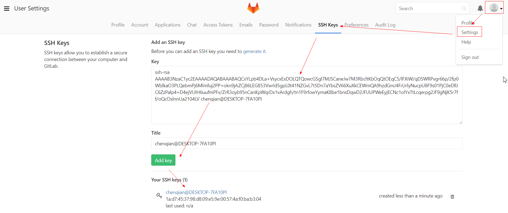
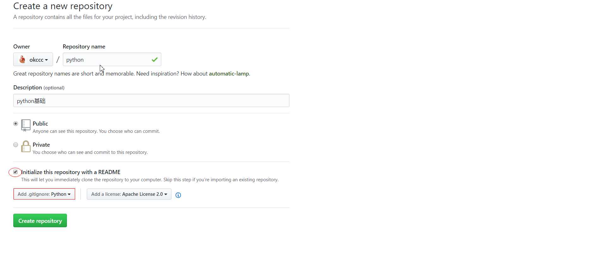

## git
- 安装：yum install git
- 安装完配置用户和邮箱：  
git config --global user.name "okccc"(这样就不用每次同步到github都输密码)  
git config --global user.email "1573976179@qq.com"(此处email要和github保持一致,不然github上没有小绿块)    
查看配置列表：git config --global --list  
优先级：--system(系统) < --global(用户) < --local(当前仓库,可单独指定用户邮箱)       
打开配置文件：git config -e --system(/etc/gitconfig ) --global(~/.gitconfig) --local(/project/.git/config)  
解决中文乱码：git config --global core.quotepath false
- 选中某个目录作为仓库：cd mygit
- 初始化仓库：git init
- 将工作区文件(夹)添加到暂存区：git add aaa.txt 或者 git add . 
- 查看工作区/暂存区/仓储区文件的状态：git status  
  
- 将暂存区文件提交到版本库形成版本记录：git commit -m '...'(注意：git只会提交暂存区的修改来创建版本,工作区的修改必须先添加到暂存区)  
- 如果是已经在track的文件可以不用添加直接提交：git commit -am 'all message ...'
- 查看版本记录：git log 或者 git log --pretty=oneline aaa.txt
- 配置别名：git config --global alias.lg 'log --graph --pretty=oneline --abbrev-commit'
- 删除别名：git config --global --unset alias.lg
- 查看操作记录：git reflog
- 版本回退(慎用!)：git reset 38fd442 或者 git reset HEAD^/HEAD~1/HEAD~10(HEAD是指向当前版本的指针默认指向master分支)
- 撤销修改/删除  
场景1：只修改/删除了工作区文件,直接丢弃改动：git checkout -- aaa.txt  (git checkout本质上是用版本库的版本替换工作区的版本)  
场景2：修改/删除了工作区文件并添加到了暂存区,先取消暂存再丢弃改动：git reset HEAD aaa.txt & git checkout -- aaa.txt  
场景3：不仅添加到暂存区还提交到了版本库,先回退版本再丢弃改动：git reset HEAD^ & git checkout -- bbb.txt
- 对比文件  
对比工作区和HEAD版本：git diff HEAD -- aaa.txt  
对比不同HEAD版本：git diff HEAD HEAD^ -- aaa.txt
- 删除文件(夹),本地和远程都删除：git rm -r .idea & git commit -am 'delete...' & git push
- 删除已经托管到github的文件(夹),本地保留：添加.idea/到.gitignore & git rm -r --cached .idea/ & git commit -am 'delete...' & git push
## branch
- 查看当前分支：git branch 
- 查看远程/所有分支：git branch -r/-a
- 创建分支：git branch dev
- 切换分支：git checkout dev
- 创建并切换分支：git checkout -b dev(开发人员平时往dev分支做合并,然后定期合并到master分支发布上线)
- 在dev分支上修改提交：git add ... & git commit -m '...' & git checkout master
- 对比分支差异：git diff dev
- 快速合并某分支到当前分支：git merge dev(当不同分支编辑同一个文件并且都提交后做合并操作会冲突,先解决冲突再重新提交合并)
- 禁用快速合并：git merge --no-ff -m 'no fast-forward' dev  
应用场景：当代码写到一半时突然发现前面有个紧急bug要处理,这时候先保护工作现场此时工作区是干净的,然后创建一个临时的bug分支处理完bug后merge到dev分支,此时最好禁用快速合并,不然删掉临时bug分支后看不到merge修复bug的版本记录,最后再回到工作现场继续工作  
- 保护工作现场：git stash  
- 查看保护工作现场列表：git stash list  
- 创建bug分支：git checkout -b bug001 & ... & git checkout dev & git merge bug001 
- 恢复工作现场：git stash pop  
- 删除已合并的分支：git branch -d bug001(只能删除已经merge过的分支)
- 开发新功能时一般创建feature分支：git branch -b feature & ...
- 强制删除未合并的分支：git branch -D feature
- 将本地分支推送到远程：git push origin dev
- 删除远程分支：git push origin :dev
## tag
- 查看所有标签：git tag
- 新建标签,默认打在最新提交的commit上：git tag v0.1
- 新建标签,指定打在某次提交的commit上：git tag v0.1 f52c633
- 新建标签并指定标签信息：git tag -a v0.1 -m '...'
- 查看标签信息：git show v0.1
- 推送指定标签到远程：git push origin v0.1
- 推送所有标签到远程：git push origin --tags
- 删除本地标签：git tag -d v0.1
- 删除远程标签：git tag -d v0.1 & git push origin :refs/tags/v0.1
## github
- 在本地生成ssh秘钥: ssh-keygen -t rsa -C "company/personal"  

- 私钥保留,将公钥复制到gitlab账号  
 
- 测试是否成功连接：ssh -T git@github.com 
- github创建新工程

#### git fetch
- git fetch <远程主机名> <远程分支名>:<本地分支名>  取回远程主机指定分支的更新到本地,不加分支名表示取回所有分支的更新
- git fetch origin master：取回origin主机的master分支的更新到本地
- git log -p master..origin/master：对比本地master分支和origin/master分支的补丁(-p是-patch缩写,补丁/修补的意思) 
- git merge origin/master：将origin/master分支合并到当前分支
- git fetch origin master:tmp(将远程master分支下载到本地tmp分支) & git diff tmp & git merge tmp & git branch -d tmp
#### git pull
- git pull <远程主机名> <远程分支名>:<本地分支名>  取回远程主机某个分支的更新并与本地指定分支合并
- git pull origin master:master  取回origin主机的master分支并与本地master分支合并  
如果当前就是master分支可以省略本地分支名：git pull origin master  
如果当前分支与远程分支已经存在追踪关系可以省略分支名：git pull origin  
如果当前分支只有一个追踪分支主机名都可以省略：git pull
- git branch --set-upstream master origin/master：建立本地分支和远程分支的追踪关系
- git pull == git fetch & git merge --no-ff origin/master 
#### git push
- git push <远程主机名> <本地分支名>:<远程分支名>  将本地分支的更新推送到远程主机  
注意：分支推拉顺序是<来源地>:<目的地>,所以git pull是远程分支在前而git push是本地分支在前
- git push origin master:master  将本地的master分支推送到origin主机的master分支  
如果本地分支与远程分支已经存在追踪关系可以省略远程分支名：git push origin master  
如果省略本地分支名表示删除指定的远程分支(推送的是空的本地分支)：git push origin :master  
如果当前分支刚好是要推送的分支可以省略分支名：git push origin  
如果当前分支只有一个追踪分支主机名都可以省略：git push
如果当前分支与多个主机存在追踪关系可用-u指定默认主机：git push -u origin master
#### git remote
- a、将已有远程库克隆到本地：git clone git@github.com:okccc/python.git
- b、如果是先有本地仓库,可以在远程github创建一个新仓库(空的,不包含readme.md和.gitignore)  
关联远程库：git remote add origin git@github.com:okccc/python.git  
查看远程主机地址：git remote -v  
查看远程主机详细信息：git remote show <主机名>
第一次推送本地master分支到远程：git push -u origin master(-u指定origin为默认主机,以后再推送就直接git push)  
- 切换远程库：git remote rm <主机名> (删除关联的远程主机) & git remote add <主机名> <url地址> (添加新的远程主机)
#### 多人协作流程
- 多台电脑操作同一个github账号时,要在各自电脑ssh-keygen,user.name和user.email可以相同也可以不同
- 甲创建远程origin的dev分支到本地：git checkout -b dev origin/dev
- 推送到远程：git add aaa.txt & git commit -m 'add aaa' & git push origin dev
- 如果此时乙也编辑了aaa.txt那么直接push会冲突,需要先git pull把最新的提交从origin/dev上抓下来在本地合并解决冲突后再推送  
git pull居然也失败了？提示no tracking information：是因为本地的dev分支没有和远程的origin/dev分支建立连接  
建立连接：git branch --set-upstream-to=origin/dev dev  
再次pull：git pull & git status & ... & git commit -m 'fix conflict' & git push origin dev  
- 本地和远程代码不一致时要先将远程代码同步到本地  
- git fetch origin master：将origin主机的master分支的更新取到本地    
git log -p master..origin/master：比较本地master分支和origin/master分支的补丁(-p是-patch缩写,补丁/修补的意思)  
git merge origin/master：在本地分支合并远程分支 所取回的更新，在本地主机上要用"远程主机名/分支名"的形式读取。比如origin主机的master，就要用origin/master读取。  
- git pull origin/master：从远程获取最新代码并直接merge到本地(不安全因为看不到更新情况)
- 将分叉的提交历史整理成一条直线：git rebase
#### pycharm拉代码
.png)
.png)

  

