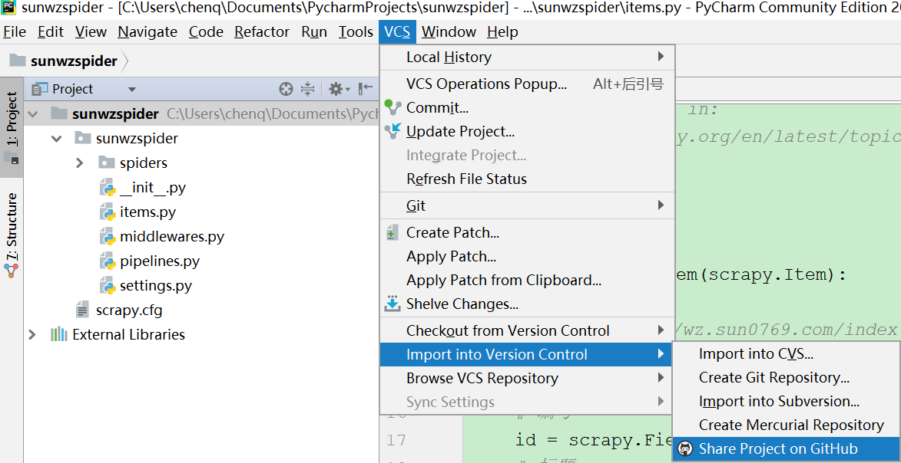
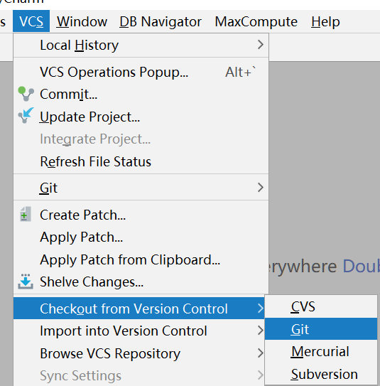
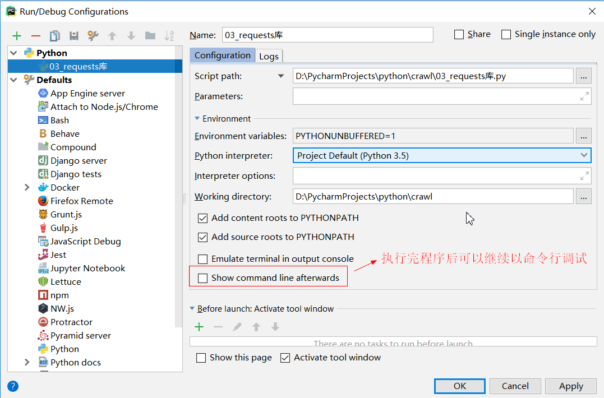

## pycharm安装使用
[先在本地安装git](https://jingyan.baidu.com/article/a3a3f811d4cd308da2eb8ad1.html)  
[pycharm配置github](http://www.cnblogs.com/feixuelove1009/p/5955332.html)  
***
#### 配置settings
  
pycharm可以export/import默认配置模板(字体、样式等)
#### 配置Github  
  
  
#### 配置Interpreter  
 
#### check out 
  
#### import into  

 
#### 公司一般用gitlab  
  
#### pycharm运行程序console设置  

