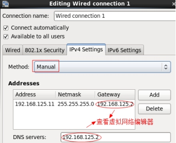
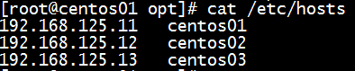

- [虚拟机安装文档](http://www.cnblogs.com/shishanyuan/p/4701510.html)  
- [cdh5安装文档1](https://www.zybuluo.com/sasaki/note/242142)  
- [cdh5安装文档2](http://www.jianshu.com/p/57179e03795f)    

## environment
- 修改ip地址  
System - Preferences - Network Connection - service network restart  
  

- 放弃图形化界面  
vim /etc/inittab - id选3 (多用户模式即linux界面) - reboot  

- sudo  
vim /etc/sudoers 添加一行 hadoop ALL(ALL) ALL

- 修改主机名  
vim /etc/sysconfig/network - hostname master  

- 修改ip和主机名映射关系  
vim /etc/hosts  
  

- 禁用selinux  
vim /etc/sysconfig/selinux - SELINUX=disabled  

- 防火墙  
开启关闭防火墙 service iptables status/start/stop  
查看防火墙是否开机自启 chkconfig iptables on/off/--list 
 
- mysql  
开启关闭mysql service mysqld status/start/stop  
查看mysql是否开机自启 chkconfig mysqld on/off/--list 

- 创建CM用的数据库  
集群监控：create database amon DEFAULT CHARSET utf8 COLLATE utf8_general_ci;  
hive：create database hive DEFAULT CHARSET utf8 COLLATE utf8_general_ci;  
oozie：create database oozie DEFAULT CHARSET utf8 COLLATE utf8_general_ci;  
hue：create database hue DEFAULT CHARSET utf8 COLLATE utf8_general_ci;

- 安装jdk和scala  
vim /etc/profile  
export JAVA_HOME=/usr/java/jdk1.8.0_65  
export PATH=$PATH:$JAVA_HOME/bin  
刷新配置：source /etc/profile  
查看版本：java -version  
查看jdk安装目录：echo $JAVA_HOME  

- 下载第三方依赖  
yum -y install chkconfig python bind-utils psmisc libxslt zlib sqlite cyrus-sasl-plain cyrus-sasl-gssapi fuse fuse-libs redhat-lsb httpd mod_ssl

- 克隆虚拟机并修改ip地址和主机名  

- 配置ssh免密登录  
在centos01上生产一对钥匙：ssh-keygen -t rsa  
将公钥拷贝到其他节点：ssh-copy-id centos01/centos02/centos03  

## Cloudera Manager  
[CM下载地址、](http://archive.cloudera.com/cm5/cm/5/)
[离线库下载地址](http://archive.cloudera.com/cdh5/parcels)  
 
 
- cm安装包  
tar -zxvf /opt/software/cloudera-manager-el6-cm5.12.1_x86_64.tar.gz -C /opt  

- parcel包(包含hadoop、hdfs等)  
将CDH5相关包移到/opt/cloudera/parcel-repo并将sha1重命名为sha,不然会重新下载

- 在所有节点创建cloudera-scm用户  
useradd --system --home=/opt/cm-5.12.1/run/cloudera-scm-server/ --no-create-home --shell=/bin/false --comment "Cloudera SCM User" cloudera-scm  

- 配置agent  
vim /opt/cm-5.12.1/etc/cloudera-scm-agent/config.ini  
server_host=centos01 

- 配置CM数据库  
cp mysql-connector-java.jar /usr/share/java/  
/opt/cm-5.12.1/share/cmf/schema/scm_prepare_database.sh mysql cm -hlocalhost -uroot -proot --scm-host localhost scm scm scm  

- 分发cm和parcel到其它节点  
scp -r /opt/cloudera/ centos02:/opt/  
scp -r /opt/cloudera/ centos03:/opt/

- 启动脚本  
主节点：/opt/cm-5.12.1/etc/init.d/cloudera-scm-server start  
所有节点：/opt/cm-5.12.1/etc/init.d/cloudera-scm-agent start  
启动Manager会在数据库中创建对应的表耗时略长 -> netstat -an | grep 7180  
web页面：http://centos01:7180 - admin/admin  

- SecureCRT参数设置  
  
  