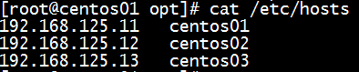
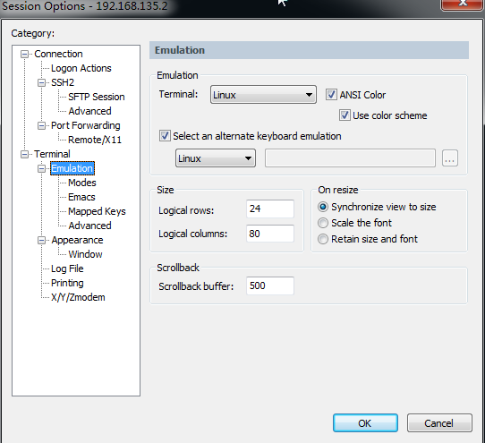
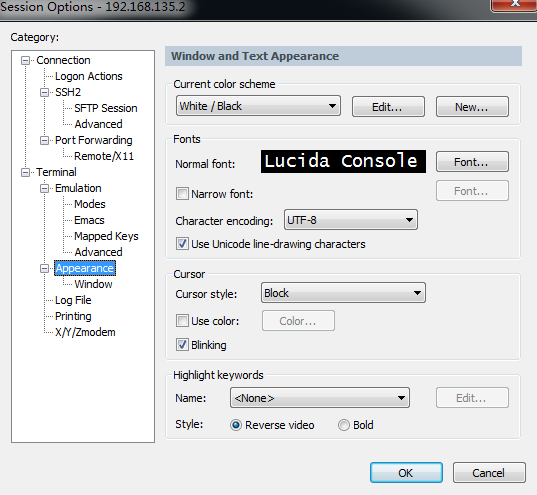

## CDH5安装
[虚拟机安装文档](http://www.cnblogs.com/shishanyuan/p/4701510.html)  
[cdh5安装文档1](https://www.zybuluo.com/sasaki/note/242142)  
[cdh5安装文档2](http://www.jianshu.com/p/57179e03795f)    
一：环境准备
Centos安装完后，System--->Preferences--->Network Connection  
  

修改完ip后，service network restart  
设置网络代理：  
grubby@ubuntu:~$env|grep proxy  
http_procy=http://proxy-shz.intel.com:911/  
ftp_proxy=ftp://proxy-shz.intel.com:911/  
https_proxy=https://proxy-shz.intel.com:911/  
常见命令：（非root用户，如果没有创建新用户就是root用户，不需要sudo）  
放弃图形化界面：su进入root权限  vi /etc/inittab   id选3 （多用户模式即linux界面），reboot重启；  
sudo命令：su进入root权限  vi /etc/sudoers 添加一行 hadoop ALL(ALL) ALL    exit  
修改主机名：sudo vim /etc/sysconfig/network   sudo hostname master   exit  
修改主机名和IP映射关系：sudo vim /etc/hosts  
  
注意：ip在前主机名在后，不然ssh 主机名不通  
修改IP地址：sudo setup     sudo service network restart           
禁用selinux：vim /etc/sysconfig/selinux    SELINUX=disabled  
防火墙：  
查看防火墙状态：sudo service iptables status     sudo ufw status  
关闭防火墙：sudo service iptables stop              ufw disable          卸载：apt-get remove iptables
查看防火墙开机启动状态：sudo chkconfig iptables --list    
防火墙的开机自启：sudo chkconfig iptables on/off  
myqsl：  
查看mysql开机启动状态：sudo chkconfig mysqld --list     
Mysql开机自启：sudo chkconfig mysqld on/off  
启动/停止/查看状态：sudo service mysqld start/stop/status                                       
安装jdk / Scala  
sudo vim /etc/profile  
在文件末尾添加：export JAVA_HOME=/home/cq/jdk1.8.0_65  
                              export PATH=$PATH:$JAVA_HOME/bin  
刷新配置：source /etc/profile  
查看版本：java -version    查看jdk安装目录：echo $JAVA_HOME  
现在可以克隆虚拟机了  
分别修改centos02，centos03的IP地址和主机名  
配置ssh免密登录  
在centos01上生产一对钥匙：ssh-keygen -t rsa  
将公钥拷贝到其他节点，包括自己  
ssh-coyp-id centos01  
ssh-coyp-id centos02  
ssh-copy-id centos03  
rpm：包管理工具(q,i,e,u)  
参数：  
-q, --query                        查询  
-a, --all                             所有  
-i, --install                         install package(s)  
-v, --verbose                    provide more detailed output  
-h, --hash                         print hash marks as package installs (good with -v)  
-e, --erase                        erase (uninstall) package  
-U, --upgrade=<packagefile>+      upgrade package(s)  
--test                                安装测试，并不实际安装  
--nodeps                          忽略软件包的依赖关系强行安装/删除  
--force                             忽略软件包及文件的冲突  
示例：  
rpm -qa|grep -i mysql                              (查询,-i忽略大小写)  
rpm -ev MySQL-server-5.6.21-1.el6.x86_64           (删除)  
rpm -ev --nodeps mysql-libs-5.1.71-1.el6.x86_64    (忽略依赖关系强行删除)  
rpm -ivh file.rpm                                  (显示安装进度 )  
rpm -Uvh file.rpm                                  (升级安装包)  
二：安装Cloudera Manager Server和Agent  
1、在/opt目录下解压cloudera-manager-el6-cm5.8.2_x86_64.tar安装包0  
2、为CM5建立数据库  
cp mysql-connector-java.jar /opt/cm-5.8.2/share/cmf/lib/  
在master节点初始化CM5数据库  
/opt/cm-5.8.2/share/cmf/schema/scm_prepare_database.sh mysql cm -hlocalhost -uroot -proot --scm-host localhost scm scm scm  
3、配置agent  
vim /opt/cm-5.8.2/etc/cloudera-scm-agent/config.ini   
server_host=centos01  
同步到其它节点  
4、在所有节点创建cloudera-scm用户  
useradd --system --home=/opt/cm-5.8.2/run/cloudera-scm-server/ --no-create-home --shell=/bin/false --comment "Cloudera SCM User" cloudera-scm   
5、准备Parcels，安装CDH5  
将CHD5相关的Parcel包放到主节点的/opt/cloudera/parcels/目录中  

将sha1重命名为sha，不然会重新下载  
6、启动脚本  
主节点：/opt/cm-5.8.2/etc/init.d/cloudera-scm-server start  
所有节点：/opt/cm-5.8.2/etc/init.d/cloudera-scm-agent start  
在浏览器打开http://centos01:7180进入CDH管理界面安装服务，账号admin/admin  

SecureCRT参数设置  
  
  