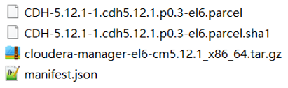
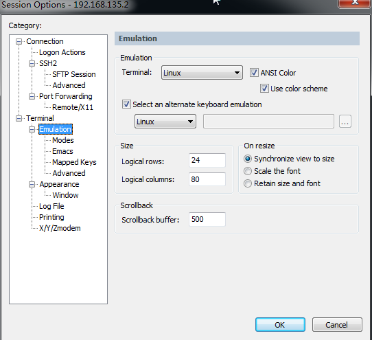
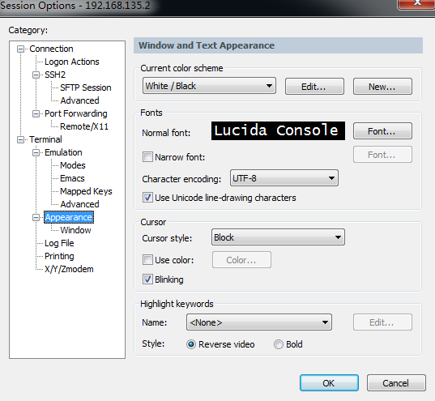

- [SecureCRT 64位 破解版](https://www.jianshu.com/p/f61a4f1f4405)
- [VMvare安装Centos7](https://zhangweisep.github.io/2019/03/02/VM%E8%99%9A%E6%8B%9F%E6%9C%BA%E5%AE%89%E8%A3%85Centos-7/)
- [cdh5安装文档1、](https://www.zybuluo.com/sasaki/note/242142)
- [cdh5安装文档2](http://www.jianshu.com/p/57179e03795f)    

## centos7
```bash
# 修改ip地址  
[root@cdh1 ~]# vim /etc/sysconfig/network-scripts/ifcfg-ens33
BOOTPROTO="static"
ONBOOT="yes"
IPADDR=192.168.189.11
GATEWAY=192.168.189.2  # 编辑 - 虚拟网络编辑器 - NAT设置
NETMASK=255.255.255.0
DNS1=8.8.8.8
[root@cdh1 ~]# service network restart
[root@cdh1 ~]# ip addr & ping www.baidu.com
# 修改主机名
[root@cdh1 ~]# vim /etc/hostname
# 修改hosts
[root@cdh1 ~]# vim /etc/hosts
192.168.189.11  cdh1 
192.168.189.12  cdh2  
192.168.189.13  cdh3
# 禁用selinux  
[root@cdh1 ~]# vim /etc/sysconfig/selinux
SELINUX=disabled 
# 查看防火墙状态
firewall-cmd --state
# 开启/关闭防火墙
systemctl start/stop firewalld 
# 防火墙开机自启
systemctl enable/disable firewalld.service
```
- 放弃图形化界面  
vim /etc/inittab - id选3 (多用户模式即linux界面) - reboot  

- sudo  
vim /etc/sudoers 添加一行 hadoop ALL(ALL) ALL


- 防火墙  
开启关闭防火墙 service iptables status/start/stop  
查看防火墙是否开机自启 chkconfig iptables on/off/--list 
 
- mysql  
开启关闭mysql service mysqld status/start/stop  
查看mysql是否开机自启 chkconfig mysqld on/off/--list 

- 创建CM用的数据库  
集群监控：create database amon DEFAULT CHARSET utf8 COLLATE utf8_general_ci;  
hive：create database hive DEFAULT CHARSET utf8 COLLATE utf8_general_ci;  
oozie：create database oozie DEFAULT CHARSET utf8 COLLATE utf8_general_ci;  
hue：create database hue DEFAULT CHARSET utf8 COLLATE utf8_general_ci;

- 安装jdk和scala  
vim /etc/profile  
export JAVA_HOME=/home/project/jdk1.8  
export PATH=$PATH:$JAVA_HOME/bin  
刷新配置：source /etc/profile  
添加软连接：ln -s /home/project/jdk1.8/bin/java /usr/bin/java  
查看版本：java -version  
查看jdk安装目录：echo $JAVA_HOME  

- 下载第三方依赖  
yum -y install chkconfig python bind-utils psmisc libxslt zlib sqlite cyrus-sasl-plain cyrus-sasl-gssapi fuse fuse-libs redhat-lsb httpd mod_ssl

- 克隆虚拟机并修改ip地址和主机名  

- 配置ssh免密登录  
在centos01上生产一对钥匙：ssh-keygen -t rsa  
将公钥拷贝到其他节点：ssh-copy-id centos01/centos02/centos03  

## Cloudera Manager  
[CM下载地址、](http://archive.cloudera.com/cm5/cm/5/)
[离线库下载地址](http://archive.cloudera.com/cdh5/parcels)  
  
 
- cm安装包(el6 -> centos6)  
tar -zxvf /opt/software/cloudera-manager-el6-cm5.12.1_x86_64.tar.gz -C /opt  

- parcel包(包含hadoop、hdfs等)  
将CDH5相关包移到/opt/cloudera/parcel-repo并将sha1重命名为sha,不然会重新下载

- 在所有节点创建cloudera-scm用户  
useradd --system --home=/opt/cm-5.12.1/run/cloudera-scm-server/ --no-create-home --shell=/bin/false --comment "Cloudera SCM User" cloudera-scm  

- 配置agent  
vim /opt/cm-5.12.1/etc/cloudera-scm-agent/config.ini  
server_host=centos01 

- 配置CM数据库  
cp mysql-connector-java.jar /usr/share/java/  
/opt/cm-5.12.1/share/cmf/schema/scm_prepare_database.sh mysql cm -hlocalhost -uroot -proot --scm-host localhost scm scm scm  

- 分发cm和parcel到其它节点  
scp -r /opt/cloudera/ centos02:/opt/  
scp -r /opt/cloudera/ centos03:/opt/

- 启动脚本  
主节点：/opt/cm-5.12.1/etc/init.d/cloudera-scm-server start  
所有节点：/opt/cm-5.12.1/etc/init.d/cloudera-scm-agent start  
启动Manager会在数据库中创建对应的表耗时略长 -> netstat -an | grep 7180  
web页面：http://centos01:7180 - admin/admin  

- SecureCRT参数设置  
  
  

## db
```sql
-- 通过CM安装CDH默认使用内嵌的PostgreSQL数据库
-- 数据库连接
psql -h 127.0.0.1 -p 7432 -U cloudera-scm -d postgres
-- 常用指令
\q                -- 退出psql客户端
\l                -- 列出所有的数据库
\c database_name  -- 连接到指定的数据库
\d                -- 列出当前数据库下所有表
\d table_name     -- 显示指定表的结构信息
\?                -- 列出所有sql的命令列表
\h sql            -- 查看sql命令的解释,比如\h select 
-- hive库下表名都是大写,查询时要加""不然报错
hive=# select * from "DBS";
-- 做crud操作时,字符串只能用'',""会被认为是column
hue=# update auth_user set is_active='f' where id=10;
```
```sql
[root@master1 data]# psql -h 127.0.0.1 -p 7432 -U cloudera-scm -d postgres
Password for user cloudera-scm: 
psql (9.2.24, server 9.2.23)
Type "help" for help.

postgres=# \l
                                                List of databases
        Name        |       Owner        | Encoding |  Collate   |   Ctype    |         Access privileges         
--------------------+--------------------+----------+------------+------------+-----------------------------------
 amon               | amon               | UTF8     | en_US.UTF8 | en_US.UTF8 | 
 hive               | hive               | UTF8     | en_US.UTF8 | en_US.UTF8 | 
 hue                | hue                | UTF8     | en_US.UTF8 | en_US.UTF8 | =Tc/hue                          +
                    |                    |          |            |            | hue=CTc/hue
 nav                | nav                | UTF8     | en_US.UTF8 | en_US.UTF8 | 
 navms              | navms              | UTF8     | en_US.UTF8 | en_US.UTF8 | 
 oozie_oozie_server | oozie_oozie_server | UTF8     | en_US.UTF8 | en_US.UTF8 | 
 postgres           | cloudera-scm       | UTF8     | en_US.UTF8 | en_US.UTF8 | 
 rman               | rman               | UTF8     | en_US.UTF8 | en_US.UTF8 | 
 scm                | scm                | UTF8     | en_US.UTF8 | en_US.UTF8 | 
 template0          | cloudera-scm       | UTF8     | en_US.UTF8 | en_US.UTF8 | =c/"cloudera-scm"                +
                    |                    |          |            |            | "cloudera-scm"=CTc/"cloudera-scm"
 template1          | cloudera-scm       | UTF8     | en_US.UTF8 | en_US.UTF8 | =c/"cloudera-scm"                +
                    |                    |          |            |            | "cloudera-scm"=CTc/"cloudera-scm"
(11 rows)

postgres=# 
```

数据库|功能|账号密码
:--:|:--|:--
postgres|管理员账号cloudera-scm|/var/lib/cloudera-scm-server-db/data/generated_password.txt
scm|cdh的metastore(集群配置的元数据)|/etc/cloudera-scm-server/db.properties
hive|hive的metastore(表的元数据)|hive-site.xml
hue|hue的metastore(用户,权限...)
amon|activity monitor(活动监控)|/etc/cloudera-scm-server/db.mgmt.properties
smon|service monitor(服务监控)
rmon|report monitor(报告管理)
hmon|host monitor(主机监控)
nav|cloudera navigator(cloudera导航)