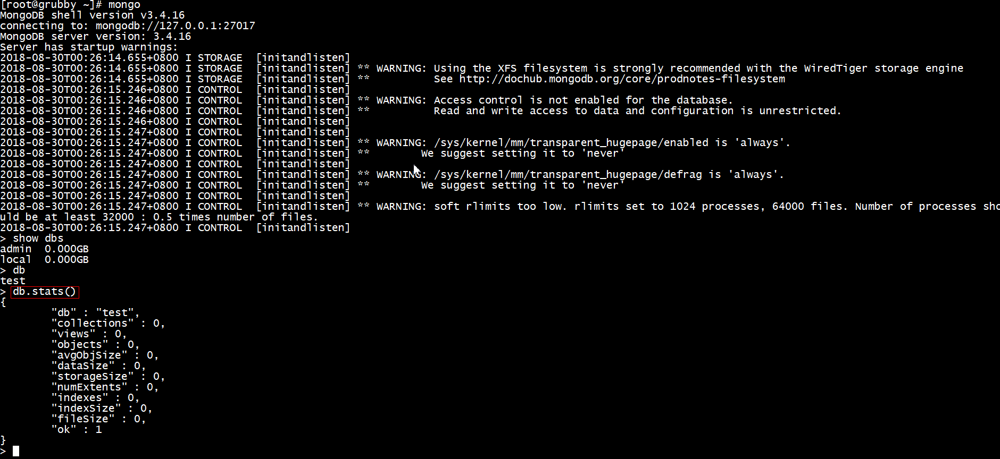

## centos安装MongoDb
[参考文档](https://www.cnblogs.com/web424/p/6928992.html)
***
- 配置MongoDb的yum源  
vim /etc/yum.repos.d/mongodb-org-3.4.repo  
添加以下内容：  
[mongodb-org-3.4]  
name=MongoDB Repository  
baseurl=https://repo.mongodb.org/yum/redhat/$releasever/mongodb-org/3.4/x86_64/    
gpgcheck=0  
enabled=1  
gpgkey=https://www.mongodb.org/static/pgp/server-3.4.asc  

- 安装MongoDb  
yum -y install mongodb-org  

- 查看mongo安装位置  
whereis mongod  

- vim /etc/mongod.conf    
将bindIp注释掉允许远程访问  

- 设置mongo开机启动  
chkconfig mongod on/off/--list  

- 查看mongo运行状态  
service mongod status/start/stop/restart  

- Mongo shell
  
