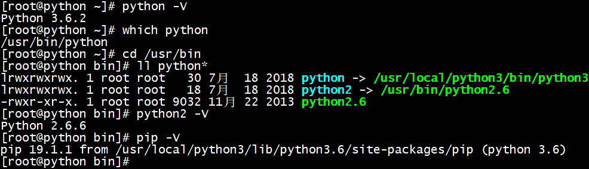

## centos安装python3
[参考文档](http://www.cnblogs.com/JahanGu/p/7452527.html)
- 查看系统已有python版本和执行路径  
  

- 安装依赖  
centos6.5：yum install zlib-devel bzip2-devel openssl-devel ncurses-devel sqlite-devel readline-devel tk-devel gcc make  
centos7：yum groupinstall development  
- 官网下载python3  
wget https://www.python.org/ftp/python/3.6.2/Python-3.6.2.tar.xz  
- 解压  
tar -xvf Python-3.6.2.tar.xz
- 进入python目录  
cd Python-3.6.2
- 编译安装  
./configure prefix=/usr/local/python3  
make && make install (耗时较长) --> 安装完发现/usr/local目录下已经有python3
- 添加软链接到执行目录/usr/bin  
ln -s /usr/local/python3/bin/python3 /usr/bin/python
- python3自带pip3给pip添加软连接  
ln -s /usr/local/python3/bin/pip3 /usr/bin/pip
- 由于执行yum需要python2所以要修改下yum配置  
vim /usr/bin/yum  
将#! /usr/bin/python 修改为 #! /usr/bin/python2
- **以后使用pip安装的包都在/usr/local/python3/bin目录下,可以添加软连接**
- pip常用命令  
安装：pip install requests  
卸载：pip uninstall requests  
升级：pip install --upgrade requests  
搜索包：pip search requests  
查看所有包：pip list/freeze  
查看可升级包：pip list -o  
导出所有包：pip freeze > requirements.txt & pip install -r requirements.txt  
查看包详细信息：pip show requests  
```bash
$ pip show requests
Name: requests
Version: 2.21.0
Summary: Python HTTP for Humans.
Home-page: http://python-requests.org
Author: Kenneth Reitz
Author-email: me@kennethreitz.org
License: Apache 2.0
Location: c:\users\admin\appdata\roaming\python\python36\site-packages
Requires: certifi, idna, chardet, urllib3
Required-by: moviepy, itchat, baidu-aip
```  
