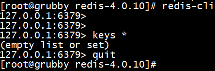
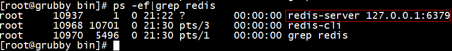

## centos安装redis
[参考文档](https://www.cnblogs.com/freeweb/p/5276558.html)
***
- 下载压缩包  
wget http://download.redis.io/releases/redis-4.0.10.tar.gz

- 解压  
tar -xvf redis-4.0.10.tar.gz  

- 切换进入  
cd /usr/local/redis-4.0.10  

- 编译安装  
make && make install  --> 安装完发现/usr/local/bin下多了几个可执行文件

- 修改redis.conf  
daemonize yes  --> 允许redis后台运行  
将bind 127.0.0.1改成bind 192.168.19.11/0.0.0.0  --> 这样其他机器可以通过ip连接该redis,不然只能本地连接  
将requirepass放开并设置登录密码  --> redis-cli -h 192.168.19.11 -p 6379 -a ***  

- 进入redis目录,启动redis服务    
redis-server ./redis.conf

- 启动redis客户端  
redis-cli  

- 查看redis是否正常运行  
ps -ef | grep redis  

- 修改配置文件时要先redis-cli shutdown关闭redis服务再重启