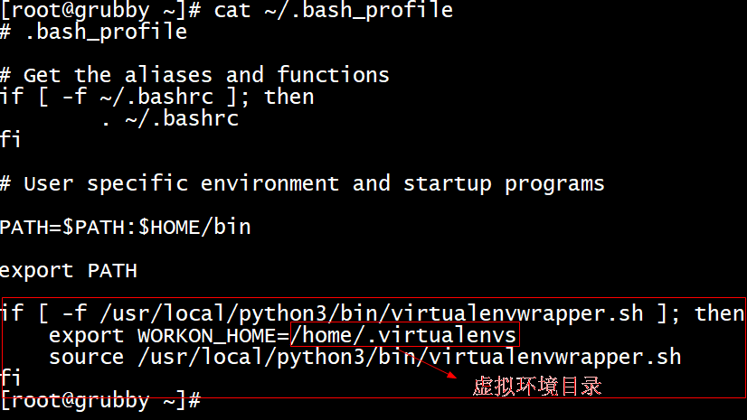
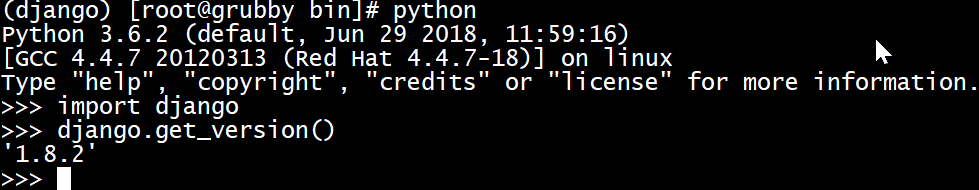

#### [参考文档](https://www.zhuxiongxian.cc/2017/09/28/python-install-virtualenv-and-virtualenvwrapper/)
- 不同项目使用的包版本可能不一样,最好每个项目单独使用一个虚拟环境,是真实python环境的复制版本
- pip常用命令  
安装：pip install aaa  
升级：pip install -upgrade aaa  
卸载：pip uninstall aaa
- 安装virtualenv  
pip install virtualenv
- 可能会碰到以下错误  
pip._vendor.urllib3.exceptions.ReadTimeoutError: HTTPSConnectionPool(host='files.pythonhosted.org', port=443): Read timed out.  
解决：将报错的域名添加到信任列表 pip install --trusted-host files.pythonhosted.org virtualenv
- 安装virtualenvwrapper  
pip install virtualenvwrapper
- 将virtualenvwrapper.sh配入当前shell环境  

- 使环境变量生效  
source ~/.bash_profile
- 添加软连接  
ln -s /usr/local/python3/bin/virtualenv /usr/bin/virtualenv
- 查看是否可用  
mkvirtualenv --help
- 常用命令  
创建：mkvirtualenv test  
删除：rmvirtualenv test  
进入：workon test  
退出：deactivate  
查看所有：lsvirtualenv  
- 安装django  
pip install django==1.8.2
- 查看版本  

