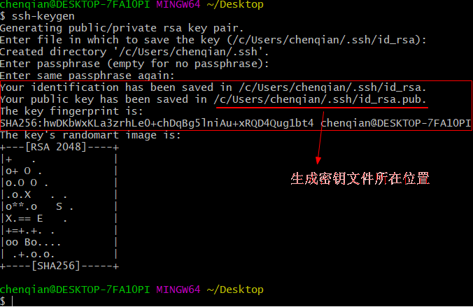
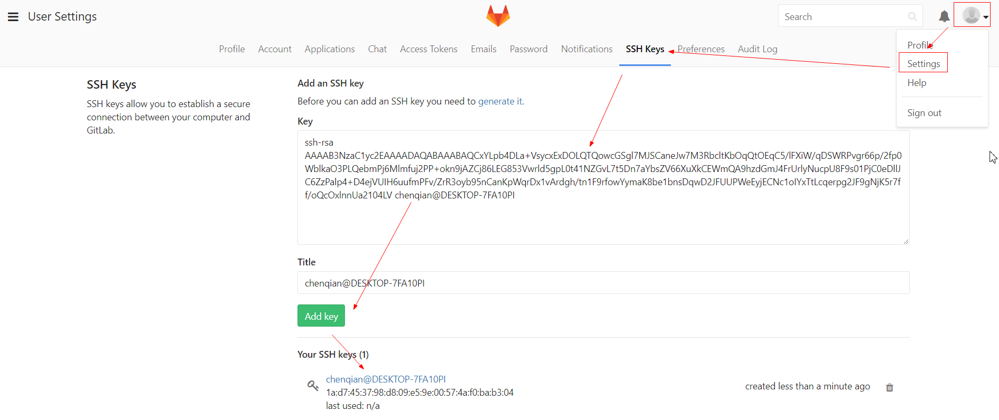
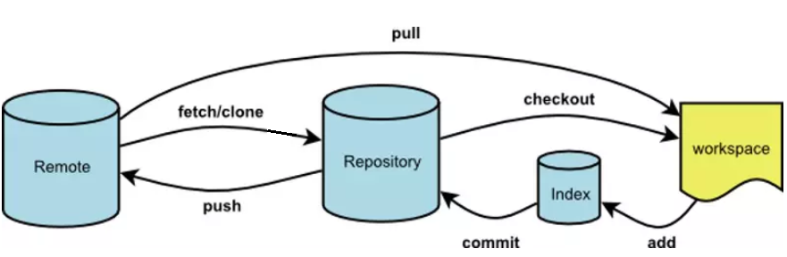

### basic
```bash
# 安装
yum install git
# 查看配置列表
git config --global -l/--list
# 配置优先级
--system(系统) < --global(用户) < --local(当前仓库,可单独指定用户邮箱)
# 打开配置文件
git config -e --system(/etc/gitconfig ) --global(~/.gitconfig) --local(/project/.git/config)
# 配置用户和邮箱：  
git config --global user.name "okccc"  # 这样就不用每次同步到github都输密码
git config --global user.email "1573976179@qq.com"  # 此处email要和github保持一致,不然github上没有小绿块
# 解决中文乱码
git config --global core.quotepath false
# 配置别名
git config --global alias.lg 'log --graph --pretty=oneline --abbrev-commit'
# 删除别名
git config --global --unset alias.lg

# 初始化仓库
cd anoob & git init
# 查看文件状态
git status
# 将工作区文件(夹)添加到暂存区
git add aaa.txt | git add .
# 将暂存区文件提交到版本库形成版本记录,工作区修改必须先添加到暂存区
git commit -m '...'
# 工作区已经tracked的文件可以直接提交到版本库
git commit -am '...'
# 查看版本提交记录(commit)
git log <--author ""> <filename>
# 查看最近一次(指定)提交记录的详情
git show <commits> <filename>
# 查看最近一次(指定)提交记录的简介
git show <commits> <-s/--stat>
# 查看本地操作记录(commit/reset/pull/merge),可以查看HEAD指向的版本,常用于恢复误操作
git reflog

# reset操作(默认--soft)
git reset --soft HEAD^/HEAD~2/... # 只改变HEAD指向的版本,代码不变
git reset --hard HEAD^/HEAD~2/... # 不仅改变HEAD指向的版本,代码也会回退到那个版本(慎用！)
git reset 38fd442 | git reset HEAD^/HEAD~1/HEAD~10  # HEAD是指向当前版本的指针默认指向master分支
# 对比工作区和HEAD版本
git diff HEAD aaa.txt
# 删除工作区未track文件(git status显示Untracked)  
git clean -n/-f <path>/-df  # 提醒哪些文件会被删除/删除当前目录下所有未track文件,也可以指定path/删除当前目录下所有未track文件(夹)
# 让工作区完全回退到最近一次commit的状态,不管文件是否track
git clean -df & git reset --hard
# 回退工作区已track文件
# a.只修改或删除工作区文件(git status显示红色),直接丢弃改动,checkout本质上是用版本库的版本替换工作区的版本
git checkout aaa.txt/.
# b.修改或删除工作区文件并添加到了暂存区(git status显示绿色),先取消暂存再丢弃改动
git reset HEAD aaa.txt & git checkout aaa.txt
# c.不仅添加到暂存区还提交到了版本库(git status显示ahead),先回退版本再丢弃改动
git reset HEAD^ & git checkout aaa.txt
# d.不仅提交到了版本库还推送到了远程github,先回退本地版本然后再次推送到远程,由于本地版本behind远程版本,直接推送失败需要强制推送
git reset HEAD^ & git push origin master --force

# 删除文件(夹),本地和远程都删除
git rm -r .idea & git commit -am 'delete...' & git push
# 删除已经托管到github的文件(夹),本地保留
add .idea/ to .gitignore & git rm -r --cached .idea/ & git commit -am 'delete...' & git push
```

### branch
```bash
# 查看当前分支/远程分支/所有分支
git branch (-r/-a)
# 创建分支并切换分支
git branch dev & git checkout dev & ... | git checkout -b dev  # 开发人员平时往dev分支做合并,然后定期合并到master分支发布上线
# 对比分支差异
git checkout master & git diff dev
# 快速合并某个分支到当前分支
git merge dev  # 如果不同分支修改同一个文件并且都提交后做合并操作会冲突,先解决冲突再重新提交合并
# 禁用快速合并(应用场景：当代码写到一半时突然发现前面有个紧急bug要处理,这时候先保护工作现场此时工作区是干净的,然后创建一个临时的bug分支处理完bug后merge到dev分支,
# 此时最好禁用快速合并,不然删掉临时bug分支后看不到merge修复bug的版本记录,最后再回到工作现场继续工作)
git merge --no-ff -m 'no fast-forward' dev
# 保护工作现场 - 查看现场列表 - 创建bug分支修复bug - 恢复工作现场 - 删除已合并的分支
git stash -> git stash list -> git checkout -b bug01 & ... & git checkout dev & git merge bug01 -> git stash pop -> git branch -d bug01
# 开发新功能时一般创建feature分支
git branch -b feature & ...
# 删除分支
git branch -d feature
# 将本地分支推送到远程
git push origin dev
# 删除远程分支
git push origin :dev
```

### tag
```bash
# 查看所有标签：git tag
# 新建标签,默认打在最新提交也可以打在指定提交,指定标签信息
git tag v0.1 (f52c633) (-m '...')
# 查看标签信息
git show v0.1
# 推送指定/所有标签到远程
git push origin v0.1/--tags
# 删除本地标签
git tag -d v0.1
# 删除远程标签
git tag -d v0.1 & git push origin :refs/tags/v0.1
```

### github
- 在本地生成ssh秘钥: ssh-keygen -t rsa -C "company/personal"  

- 私钥保留,将公钥复制到gitlab账号  

- 测试是否成功连接：ssh -T git@github.com


### fetch/pull/push/remote
```bash
# fetch
git fetch <远程主机> <远程分支>:<本地分支>  # 取回远程主机指定分支的更新到本地,不加分支名表示取回所有分支的更新
git fetch origin master  # 取回origin主机的master分支的更新到本地
git log -p master..origin/master  # 对比本地master分支和origin/master分支的补丁(-p是-patch缩写,补丁/修补的意思)
git merge origin/master  # 将origin/master分支合并到当前分支
git fetch origin master:tmp & git diff tmp & git merge tmp & git branch -d tmp  # 将远程master分支下载到本地tmp分支
# git status对比的是本地master分支(refs/heads/master)和origin/master分支的本地分支(refs/remotes/origin/master)
# 本地分支commit时refs/heads/master就会随着更新,而refs/remotes/origin/master只有在fetch/pull/push时才会更新,所以本地master分支commit后会提示ahead
# 而当别人更新了远程origin/master后由于本地origin/master还未同步所以显示的是up to date,必须先fetch/pull之后本地origin/master更新了才会提示behind

# pull
git pull <远程主机> <远程分支>:<本地分支>  # 取回远程主机某个分支的更新并与本地指定分支合并
git pull origin master:master  # 取回origin主机的master分支并与本地master分支合并  
git pull origin master  # 如果当前就是master分支可以省略本地分支  
git pull origin  # 如果当前分支与远程分支已经存在追踪关系可以省略分支名  
git pull  # 如果当前分支只有一个追踪分支主机名都可以省略
git pull == git fetch & git merge --no-ff origin/master  # 获取远程最新代码并直接merge到本地工作区(不安全因为看不到更新情况)

# push
git push <远程主机> <本地分支>:<远程分支>  # 将本地分支的更新推送到远程主机,分支推拉顺序是<来源地>:<目的地>,所以pull是远程分支在前而push是本地分支在前
git push origin master:master  # 将本地的master分支推送到origin主机的master分支
git push origin master  # 如果本地分支与远程分支已经存在追踪关系可以省略远程分支
git push origin :master  # 如果省略本地分支表示删除指定的远程分支(推送的是空的本地分支)
git push origin  # 如果当前分支刚好是要推送的分支可以省略分支名
git push  # 如果当前分支只有一个追踪分支主机名都可以省略
git push -u origin master  # 如果当前分支与多个主机存在追踪关系可用-u指定默认主机

# remote
# a.将github工程克隆到本地
git clone git@github.com:okccc/python.git
# b.将本地工程分享到github
git init - git commit -am 'init' - VCS - Import into Version Control - Share Project on GitHub
# 或者先在github创建一个空仓库(不包含readme.md和.gitignore) - 初始化本地库 - 关联远程库 - 推送本地master分支到远程
# 查看远程主机地址/详细信息
git remote -v/show <主机名>
# 关联远程库
git remote add origin git@github.com:okccc/python.git
# 第一次推送本地master分支到远程
git push -u origin master  # -u指定origin为默认主机,以后再推送就直接git push  
# 切换远程库,先删除已关联的再添加新的
git remote rm <主机名> & git remote add <主机名> <url地址>
# 建立远程/本地分支的追踪关系
git branch --set-upstream-to=origin/master master

# coordinate
# 多台电脑操作同一个github账号时,要在各自电脑ssh-keygen,user.name和user.email可以相同也可以不同
# 甲创建远程origin的dev分支到本地,一顿操作之后推送到远程
git checkout -b dev origin/dev & ... & git commit -am '...' & git push origin dev
# 如果此时乙修改相同文件直接push就会冲突,要先git pull把最新的提交从origin/dev上抓下来在本地合并解决冲突后再推送  
# git pull居然也失败了？提示no tracking information,是因为本地的dev分支没有和远程的origin/dev分支建立连接  
git branch --set-upstream-to=origin/dev dev -> git pull & git status & ... & git commit -am 'fix conflict' & git push origin dev  
# 将分叉的提交历史合并成一条直线
git rebase
```

### pycharm

