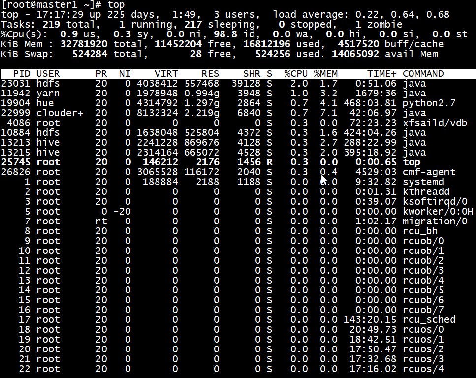
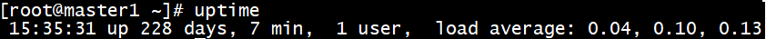
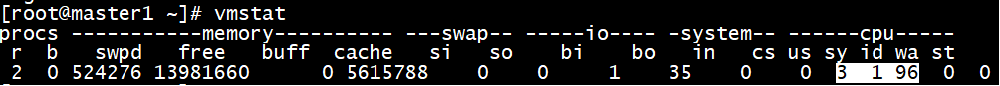
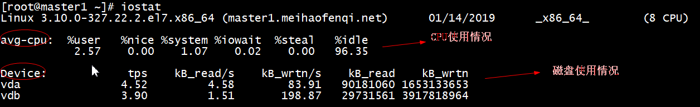

## linux
- 系统目录  
/ 根目录  
/bin 存放必要的命令  
/boot 存放内核以及启动所需的文件  
/dev 存放设备文件  
/etc 存放系统配置文件  
/home 普通用户的宿主目录,用户数据存放在其主目录中  
/lib 存放必要的运行库  
/mnt 存放临时的映射文件系统,通常用来挂载使用  
/opt 存放安装的外部软件  
/proc 存放存储进程和系统信息  
/root 超级用户的主目录  
/sbin super user存放系统管理程序  
/tmp 存放临时文件  
/usr 存放应用程序,命令程序文件、程序库、手册和其它文档  
/var 系统默认日志存放目录
  
- 开关机  
shutdown -h/-r now：立刻关机/重启
shutdown -h/-r 5：5分钟后关机/重启     

- 文件操作  
tree：查看目录结构  
ll -a/-i/-n/-h：查看隐藏内容/显示索引和文件/显示文件uid和gid/自动适应文件大小  
ls -ltr：按时间顺序倒叙显示文件列表  
history n：查看最近n条历史操作记录 !478：重新执行第478条记录
mkdir/rmdir -p a/b/c：递归创建/删除  
echo '' > a.txt：清空文件  
touch a.txt：新建一个空文件  
which java：显示可执行程序路径  
type ls：查看命令的类型  
alias：给命令设置别名,先用type查看一下是否被占用  
type foo显示没被占用,alias foo='cd /usr;ls;'再看type foo已被占用,unalias foo解绑    
{}展开：echo number{1..100}、echo {a..z}、mkdir {2005..2015}-{01..12}  
more：显示内容超过一个屏幕：空格翻页,回车下一行,q退出
less：和more类似,并且可以用j向下移,k向上移  
more或less状态下,/word 向下搜索,?word向上搜索,多个word用n显示下一个
head/tail a.txt：显示文件前/后10行  
head -100 a.txt|tail -10 >> a.log：提取日志文件的
tail -f catalina.log：动态显示文件后10行  
wc a.txt：显示3个数字分别是行数、单词数、字符数  
ls | wc -l：查看某个目录下有多少文件  
rm -rf /*：自杀  
find ./ -inum 123 -delete：可以删除rm删不掉的文件(i是文件索引)  
cp a.txt b.txt：将a.txt 复制为b.txt  
cp -r dir1 dir2：-r表示递归  
mv a.txt ../：将a.txt移动(剪切)到上一层目录  
mv a.txt b.txt：将a.txt重命名为b.txt  
压缩成.gz格式：gzip -c aaa aaa.gz  
解压.gz格式文件：gunzip aaa.gz aaa  
vim -o a.txt b.txt：分屏显示  
dd删除当前行、:2,5 d 删除第2~5行的内容  
:set nu 显示行号  
gg：顶部、shift g：底部  
ctrl b 上一页、ctrl f 下一页  
重定向：cat a.txt >/>> b.txt  覆盖/追加  
cat access.log | grep '01/Jun/2016:10' > test.log：抽出某个时间段的日志记录  
sh startup.sh && tail -f ../logs/catalina.out：启动tomcat后立刻查看tomcat日志  
echo $SHELL：显示当前shell环境变量的值  
set|tail -10：显示系统环境变量的最后10个  
sh -x test.sh：执行shell脚本时,启动跟踪模式  

- stat  
文件的3个时间戳  
Access time(atime)：读取操作 cat、cp、grep、sed、more、less、tail、head 会改变此时间  
Modify time(mtime)：修改操作 vim、ll 会改变此时间  
Change time(ctime)：修改文件属性或位置 chmod、chown、mv 会改变此时间  
 
#### 进程相关  
- nohup ./aaa.sh &: 将该脚本放在后台执行,即使关闭当前终端也能继续运行  
- jobs: 只能查看当前终端的后台运行任务jobnum,jobs -l可显示PID,jobs状态包括running/stopped/Terminated  +是当前任务/-是后一个任务    
- ps -aux: 查看当前所有进程,a显示所有程序/u以用户为主的格式来显示/x显示所有程序不以终端机来区分  
- kill %jobnum/%PID: 杀掉进程  
- fg %jobnum: 将后台程序调至前台运行
- ctrl + z: 暂停某个前台运行的命令并放到后台
- bg %jobnum: 调出暂停的后台命令继续执行   

#### 网络
- ifconfig  显示网络设备  
- ifconfig eth0 up  启用eth0网卡  
- ifconfig eth1 down  停用eth1网卡  
- ps -ef/aux|grep java：查看进程中的Java程序  
- netstat -an|grep 22：查看22端口占用情况  
- netstat -rn：查看路由表  

#### 系统管理  
- cal：显示日历 cal 2015 ：显示指定年份的日历  
- date：显示当前系统时间  
- date -R：显示时区  
- date -s "2018-08-01 15:25:30"：设置系统时间  
- hwclock -w：同步硬件时间  
- ntpdate us.pool.ntp.org：使用ntp从时间服务器同步  
- df -h：查看磁盘容量(-h表示系统自动调节合适的单位)  
- du -h/-sh：查看当前目录下所有文件大小/目录总大小
- du -h --max-depth=0,1,2：查看不同深度目录大小,=0就相当于du -sh  
- 显示磁盘信息：fdisk -l /dev/vda1  
- 查看物理cpu个数：cat /proc/cpuinfo|grep "physical id"|sort|uniq|wc -l   
- 查看每个cpu核数：cat /proc/cpuinfo|grep "cpu cores"|uniq
- who：显示当前用户登陆时间
- 显示本机信息：uname -a  
- 显示主机名：hostname、修改主机名：vim /etc/sysconfig/network  
- 查看操作系统：cat /etc/issue、cat /etc/redhat-release  
- 查看系统位数：getconf LONG_BIT  
- free -m：查看内存使用情况  
```bash
[root@master1 ~]# free -m
              total        used        free      shared  buff/cache   available
Mem(物理内存):          32013       13996       13302        2281        4714       15413
Swap(交换空间):           511           0         511
```
- swapon -s：查看交换空间使用情况  
- swapoff/swapon -a：关闭/开启swap
- 增加swap空间大小：dd if=/dev/zero of=/var/swapfile bs=1M count=2048 (bs*count)  
chmod 600 /var/swapfile & mkswap /var/swapfile & swapon /var/swapfile & swapoff /swapfile
#### <font color=red>top/htop：进程管理监控工具</font>  
第一行：系统时间 + 系统运行时间 + 用户数 + 1/5/15分钟系统平均负载  
第二行：总进程数(total) + 正在运行进程数(running) + 睡眠进程数(sleeping) + 停止的进程数(stopped) + 僵尸进程数(zombie)  
第三行：用户空间CPU占比(us) + 内核空间CPU占比(sy) + CPU空置率(id)  
PR：优先级  
NI：负值高优先级/正值低优先级
VIRT：虚拟内存  
RES：真实内存  
SHR：共享内存  
S：进程状态(D=不可中断的睡眠状态/R=运行/S=睡眠/T=跟踪或停止/Z=僵尸进程)  
%CPU：该进程占用的cpu使用率  
%MEM：该进程占用的物理内存百分比  
TIME+：该进程启动后占用cpu的总时间  
COMMAND：启动该进程的完整命令行
  
空格：立刻刷新  
i：不显示idle/zombie进程
P：根据CPU使用大小进行排序  
M：根据内存使用大小进行排序  
T：根据累计使用时间排序  
H：切换到线程模式(Tasks->Threads)  
m：切换显示内存信息  
t：切换显示进程和CPU状态信息  
c：显示完整命令行  
q：退出top命令  
W：将当前设置写入~/.toprc文件(top配置文件推荐写法)  
top -c -p 10882 -p 23256：每隔3秒显示10882和23256进程的资源使用情况,并显示命令完整路径
- uptime  
  
当前时间、系统开机运转到现在累计时间、连接用户、最近1/5/15分钟系统负载
- vmstat  
  
1、观察磁盘活动情况  
bi：每秒写到磁盘的块数(blocks/s)
bo：每秒从磁盘读取的块数(blocks/s)
wa：cpu等待磁盘io的时间比例,正常应该是0
2、观察cpu活动情况  
vmstat比top更能反映出cpu的使用情况
us：用户进程使用cpu的时间比例
sy：系统调用使用cpu的时间比例  
id：cpu空闲的时间比例  
- iostat：统计cpu和磁盘使用情况
  
%iowait：等待本地io时CPU空闲时间百分比  
%idle：未等待本地io时CPU空闲时间百分比  
tps：每秒传输KB数
KB_read/s：每秒512字节块读取数  
KB_wrtn/s：每秒512字节块写入数  
KB_read：512字节块读取的总数量  
KB_wrtn：512字节块写入的总数量  

- 用户和权限  
useradd test -d /home   添加用户并指定主目录  
passwd test             为test用户设置密码,不指定test就是root  
userdel -r test         删除test用户及主目录  
su test                 切换到test用户环境  
groupadd public         创建一个名为public的组  
useradd test -g public  创建test用户并指定组为public  
groupdel public         删除组,如果该组有用户成员,必须先删除用户才能删除组  
id hdsf                 查看hdfs用户的uid、gid、groups  
  
chmod 755 a.txt         更改对文件的读写执行权限  
chmod +x test.sh        给脚本赋予执行权限  
chown root test         将test目录所属的人改为root,组不变  
chown root:root test    将test目录所属的人和组都改为root  
chown -R root test      将test及其下所有子目录所属人都改为root(级联)   

- $  
$# 这个程序的参数个数  
$? 执行上一个指令的返回值(0表示正常)  
$0 这个程序的执行名字  
$n 这个程序的第n个参数值,n=1..9  
$* 这个程序的所有参数,此选项参数可超过9个  
$@ 跟$*类似,但是可以当作数组用  
$$ 这个程序的PID(脚本运行的当前进程ID号)  
$! 执行上一个背景指令的PID(后台运行的最后一个进程的进程ID号)  
$- 显示shell使用的当前选项,与set命令功能相同  
 
- iconv  
-l  --list                   列举所有字符集  
-f  --from-code=NAME         修改前编码  
-t  --to-code=NAME           修改后编码  
-c                           从输出中忽略无效字符  
-o  --output=file            输出文件  
-s  --silent                 安静模式  
    --verbose                打印进度信息  
-?  --help                   给出该系统求助列表  
    --usage                  给出简要的用法信息  
-V  --version                打印程序版本号  
示例：iconv -f utf-8 -c -t gbk aaa.csv > bbb.csv  

- rpm  
-q, --query                      查询  
-a, --all                        所有  
-i, --install                    install package(s)  
-v, --verbose                    provide more detailed output  
-h, --hash                       print hash marks as package installs (good with -v)  
-e, --erase                      erase (uninstall) package  
-U, --upgrade=<packagefile>+     upgrade package(s)  
--test                           安装测试,并不实际安装  
--nodeps                         忽略软件包的依赖关系强行安装/删除  
--force                          忽略软件包及文件的冲突  
示例：  
rpm -qa|grep -i mysql                              (查询,-i忽略大小写)  
rpm -ev MySQL-server-5.6.21-1.el6.x86_64           (删除)  
rpm -ev --nodeps mysql-libs-5.1.71-1.el6.x86_64    (忽略依赖关系强行删除)  
rpm -ivh file.rpm                                  (显示安装进度)  
rpm -Uvh file.rpm                                  (升级安装包)  
