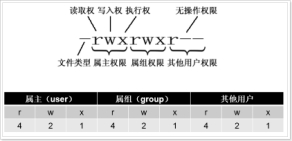

### os
```bash
# RHEL(Red Hat Enterprise Linux)：红帽公司发布的面向企业的linux操作系统,收费
# CentOS(Community enterprise Operating System)：基于RHEL的源代码二次编译而成,功能基本一样,免费
# 32位和64位操作系统
位指的是CPU一次能执行的二进制数据的位数  
32位  # 2^32 = 4,294,967,296bit = 4g 理论上32位操作系统只能使用4g内存
# 现在/5分钟后 关机/重启 
shutdown -h/-r now/5  
# 自杀
rm -rf /*
# 日历
cal (2019)  
# 使用httpd(Apache HTTP Server)作为Web server,通过ip访问linux的/var/www/html目录下的文件
yum install httpd && systemctl start httpd && systemctl enable httpd
http://192.168.152.11/a.txt
# 显示当前用户登陆时间
who
# 显示本机信息
uname -a  
# 查看操作系统
cat /etc/redhat-release
# 查看系统位数
getconf LONG_BIT
# 查看某个命令功能
whatis xxx
# 显示命令行全路径
which java
# 显示当前环境变量
echo $SHELL | echo $JAVA_HOME
# 查看cpu信息
lscpu
# 查看物理cpu个数
cat /proc/cpuinfo | grep "physical id" | sort | uniq | wc -l
# 查看每个cpu核数
cat /proc/cpuinfo | grep "cpu cores" | uniq
# 系统负载：在特定时间间隔内运行队列中的平均进程数
cat /proc/loadavg  # 最近1,5,15分钟的系统负载, 正在运行进程数/系统总进程数, 最近运行的进程id
# 查看系统运行时长
uptime  # -s,--since系统启动时间  -p,--pretty友好格式输出  -V版本号
# 显示系统环境变量后10行
set | tail -10  

# ntp(network time protocol)
# 硬件时钟：由主板电池驱动,关机后依然运行
# 系统时钟：关机时不存在,开机后系统时钟从硬件时钟同步时间,关机时将系统时间写回硬件时钟
# 查看系统时间
date  # -R 显示时区
# 查看硬件时间
hwclock
# 同步系统时钟到ntp服务器
ntpdate -u <ntp_server>
# 同步系统时钟到北京时间
ntpdate cn.pool.ntp.org
# 同步硬件时钟到系统时钟
hwclock --systohc
```

### disk
```bash
# / 根目录  
# /bin 可执行命令  
# /boot 内核以及启动所需的文件  
# /dev 设备文件  
# /etc 系统配置文件  
# /home 用户主目录,每个用户都会有一个自己的目录  
# /lib 系统最基本的共享库,几乎所有应用程序都会用到这些共享库  
# /mnt 临时映射文件系统,通常用来挂载使用  
# /opt 安装的外部软件  
# /proc 存储进程和系统信息  
# /root 超级用户主目录  
# /sbin 超级用户的可执行命令  
# /tmp 临时文件  
# /usr (非常重要)存放用户的应用程序,类似windows的program files  
# /var 系统默认日志存放目录,会不断变大

# fdisk
fdisk -l  # 显示磁盘信息  

# df (disk free)
[root@master1 ~]# df -hT  # 显示系统盘类型
# xfs 是业界最先进最具可升级性的文件系统,centos7默认xfs,centos6是ext4
# tmpfs 是不存在于实体硬盘的特殊文件系统,驻守在内存里,速度极快
Filesystem     Type      Size  Used Avail Use% Mounted on
/dev/vda1      xfs        20G   13G  7.3G  64% /
tmpfs          tmpfs      16G     0   16G   0% /dev/shm
/dev/vdb       xfs       500G   63G  438G  13% /data

[root@master1 ~]# df -ht xfs  # 显示指定类型磁盘的使用情况
Filesystem      Size  Used Avail Use% Mounted on
/dev/vda1        20G   13G  7.3G  64% /
/dev/vdb        500G   63G  438G  13% /data

# 查看inode使用率
df -i

# du (disk usage)
du -sh  # 查看当前目录占用空间大小
du -sh --time *  # 查看当前目录占用空间大小以及更新时间
du -sh * | sort -rh | head  # 查看当前目录下所有文件与目录并按大小排序
du -h  # 查看当前目录下所有文件大小
du -h -d0,d1,d2 或者 du -h --max-depth=0,1,2  # 查看不同深度目录大小,d0就相当于du -sh  

# iostat cpu和磁盘统计
[root@master1 ~]# iostat
# %user用户模式,%nice带nice值的用户模式,%system系统模式,%iowait等待模式,%steal虚拟模式,%idle空闲模式
avg-cpu:  %user  %nice  %system  %iowait  %steal  %idle
           1.97   0.00    0.71    0.01    0.00   97.31
# tps每秒传输次数,每秒读取(kb),每秒写入(kb),读取总量(kb),写入总量(kb)
Device:    tps  kB_read/s  kB_wrtn/s  kB_read  kB_wrtn
vda       4.49    16.34      53.44  985305351 3223074913
vdb       3.77     1.53     176.28   92265837 10631566714
```

### memory
```bash
# free
[root@master1 ~]# free -h -s 3  # 每隔3秒查看内存使用情况  
        total    used    free    shared  buff/cache   available
Mem:      31G     13G    4.6G      2.4G         12G         14G
Swap:    2.0G    481M    1.5G

# swap
[root@master1 ~]# swapon  # 查看交换空间使用情况 
NAME               TYPE    SIZE    USED    PRIO
/swapfile     file      2G    481M    -1
# 重新设置swap空间
dd if=/dev/zero of=/data/swapfile bs=1M count=2048  # bs*count  
# 修改权限
chmod 600 /data/swapfile 
# 指定swap文件
mkswap /data/swapfile 
# 激活新的swap
swapon /data/swapfile 
# 关闭旧的swap
swapoff /swapfile

# vmstat 虚拟内存统计,监控整体的内存、cpu、进程等信息
[root@master1 ~]# vmstat 3 3  # 每隔3秒显示刷新3次
procs  ----------memory----------  --swap--  ---io---  --system--  -----cpu-----
 r  b   swpd   free   buff  cache   si  so    bi  bo    in   cs   us sy id wa st
 1  0 483280 5978592  112 11092964   0   0     2  29     0    0    2  1 97  0  0
 0  0 483280 5978776  112 11092964   0   0     0   0  2343 6747    2  0 98  0  0
 0  0 483280 5977200  112 11092968   0   0     0   6  2349 6696    3  1 97  0  0
# procs进程：r表示运行中的进程,b表示等待的进程
# memory内存：swpd虚拟内存,free可用内存,buff缓冲内存,cache缓存内存
# swap交换空间：si每秒进交换区的大小,so每秒出交换区的大小
# io读写：bi每秒写到磁盘的块数(blocks/s),bo每秒从磁盘读取的块数(blocks/s)
# system系统：in每秒中断数,cs每秒上下文切断数
# cpu使用占比：us用户进程使用cpu时间比例,sy系统调用使用cpu时间比例,id是cpu空闲时间比例,wa是cpu等待磁盘io的时间正常是0
```

### lsof
```bash
# lsof (list open files) 列出当前系统所有进程打开的所有文件
[root@master1 ~]# lsof | head -5
# 进程名称 进程号 用户 文件描述符 文件类型 磁盘名称   文件大小   索引节点 文件名称
COMMAND   PID   USER     FD  TYPE   DEVICE    SIZE/OFF   NODE    NAME
bash      3208  root    rtd   DIR    253,0      4096       2     /
mongod    2076  mongod  txt   REG    253,0    538384    915155   /usr/bin/mongod
sshd      1728  root    4u    IPv6   14003       0t0     TCP     *:ssh (LISTEN)
mysqld    1971  mysql   cwd   DIR    253,0      4096    261193   /var/lib/mysql

-i,                  # 列出符合条件的进程打开情况(tcp/udp/:port/@ip...)
-c, --course         # 列出指定进程名称打开情况
-p, --process        # 列出指定进程号打开情况
-u, --user           # 列出指定用户打开情况
-g, --gid            # 列出指定gid的进程打开情况
-d, --description    # 列出指定描述符的进程打开情况
# 查看某个文件打开情况
lsof /bin/bash
# 查看tcp/22端口/ip的打开情况
lsof -i tcp/:22/@10.9.169.233 
# 查看mysql进程打开情况
lsof -c mysql
# 查看pid=1的打开情况
lsof -p 1
# 查看yarn用户打开情况
lsof -u yarn
# 查看gid=1的打开情况
lsof -g 1
# 查看文件描述符=4的是打开情况
lsof -d 4
```

### netstat
```bash
# netstat 监控tcp/ip网络,可以检验本机各端口的网络连接情况
[root@master1 ~]# netstat | head -5
# 有源TCP连接
Active Internet connections (w/o servers)
# 协议 接收但未处理 发送但未确认 本机地址:端口              外部地址:端口              tcp连接的socket状态
Proto   Recv-Q    Send-Q    Local Address            Foreign Address          State   
tcp       0         0       0.0.0.0:21050            0.0.0.0:*                LISTEN  
tcp       0         0       master1.meihao:palace-6  master1.meihaofen:46282  ESTABLISHED
tcp       0         0       master1.meihaofen:39856  namenode1.me:inovaport1  TIME_WAIT
tcp       0         0       master1.meihaofen:53288  master1.meihaofenq:7432  CLOSE_WAIT
# 有源Unix域套接口(只用于本机通信)
Active UNIX domain sockets (w/o servers)
# 协议  连接到本套接口的进程号  标识  状态  inode  路径
Proto RefCnt Flags       Type       State         I-Node   Path
unix  2      [ ]         DGRAM      CONNECTED     9827     /run/systemd/cgroups-agent
unix  2      [ ]         DGRAM                    9864     /run/systemd/shutdownd
unix  2      [ ]         DGRAM      CONNECTED     9427     /run/systemd/notify

-a, --all                     # 列出所有选项,包括LISTEN状态
-i, --interface               # 显示接口信息
-l, --listen                  # 只列出监听选项
-n, --not                     # 域名解析:不显示主机端口和用户,全部用数字代替
-p, --process                 # 显示相关连接的进程
-r, --route                   # 显示路由信息
-s, --sort                    # 按照协议分类统计
-t, --tcp                     # 显示tcp相关选项
-u, --udp                     # 显示udp相关选项
-x, --unix                    # 显示unix相关选项

[root@master2 ~]# netstat -anp | grep 21050  # 端口不会独立存在,而是依附于进程
tcp        0      0 0.0.0.0:21050           0.0.0.0:*               LISTEN      27652/impalad       
tcp        0      0 10.9.120.102:21050      10.9.169.233:57510      ESTABLISHED 27652/impalad       
tcp        0      0 10.9.120.102:21050      10.9.169.233:35938      ESTABLISHED 27652/impalad       

# 查看tcp的数量
netstat -ant | wc -l
# 查看tcp的各种状态统计
netstat -ant | awk '{print $6}' | sort | uniq -c | sort -nr
# 查看连接某服务端口最多的IP地址前10
netstat -ant | grep 'ip:port' | awk '{print $5}' | awk -F: '{print $1}' | sort | uniq -c | sort -nr | head -10
# 网络接口
ifconfig (network interfaces config)
ifconfig eth0 up/down  # 启用/停用eth0网卡
```

### process 
```bash
# ps (process status) 当前时刻进程快照
[root@master1 ~]# ps -ef | head  # e所有进程, f全格式
# UID用户id, PID进程id, PPID父进程id, C进程占用CPU百分比, STIME进程启动时间, 
# TTY进程在那个终端运行 ?表示与终端无关 pts/0表示由网络连接主机进程, TIME进程运行时间, CMD进程完整命令行
UID      PID   PPID   C   STIME   TTY       TIME   CMD
root       1      0   0   Apr21   ?     00:00:04   /sbin/init
root       2      0   0   Apr21   ?     00:00:00   [kthreadd]

[root@master1 ~]# ps -aux | head  # a所有进程, u以用户为主的格式, x不区分终端  
# %CPU进程占用CPU百分比, %MEM进程占用内存百分比, VSZ进程占用的虚拟内存, RSS进程占用的固定内存, STAT进程状态
USER     PID  %CPU  %MEM   VSZ  RSS  TTY  STAT  START  TIME  COMMAND
root       1   0.0   0.0 19364 1540  ?    Ss    Apr21  0:04  /sbin/init
root       2   0.0   0.0     0    0  ?    S     Apr21  0:00  [kthreadd] 

# top 动态显示进程信息
[root@master1 ~]# top
# 系统时间 + 系统运行时间 + 用户数 + 1/5/15分钟系统平均负载
top - 16:05:31 up 692 days, 37 min,  1 user,  load average: 0.20, 0.38, 0.32
# 总进程数(total) + 正在运行进程数(running) + 睡眠进程数(sleeping) + 停止的进程数(stopped) + 僵尸进程数(zombie)
Tasks: 218 total,   2 running, 215 sleeping,   0 stopped,   1 zombie
# 用户空间CPU占比(us) + 内核空间CPU占比(sy) + CPU空置率(id)  
%Cpu(s):  5.5 us,  0.5 sy,  0.0 ni, 94.0 id,  0.0 wa,  0.0 hi,  0.0 si,  0.0 st
KiB Mem : 32781920 total,  4626088 free, 14574136 used, 13581696 buff/cache
KiB Swap:  2097148 total,  1604300 free,   492848 used. 15342624 avail Mem 
# PR优先级, NI负值高优先级/正值低优先级, VIRT虚拟内存, RES真实内存, SHR共享内存, S linux进程5种状态(D=不可中断/R=运行/S=睡眠/T=停止/Z=僵尸)  
# %CPU进程占用CPU百分比, %MEM进程占用内存百分比, TIME+进程启动后占用cpu总时间, COMMAND进程完整命令行
  PID  USER      PR  NI    VIRT    RES    SHR  S  %CPU  %MEM    TIME+  COMMAND                                                                                  
32106 clouder+  20   0  8639896   2.9g  84364  S   5.0   9.4    4498:02   java                                                                                     
22292 clouder+  20   0  8347660   2.7g  13644  S   0.7   8.5    1372:14   java                                                                                     
10943 clouder+  20   0  5981184   1.4g  65396  S   0.7   4.4    1207:21   java                                                                                     
29364 hive      20   0  2358756   1.1g  41356  S   0.0   3.6   11:47.05   java                                                                                     
25562 hdfs      20   0  4977904 939212  22764  S   0.0   2.9   13:23.43   java                                                                                     
31207 impala    20   0  1895636 662760  37064  S   0.0   2.0    5:30.01   catalogd                                                                                 
26409 yarn      20   0  1887780 578052  21820  S   0.7   1.8   15:12.75   java                                                                                     
26473 mapred    20   0  1671052 542636  22188  S   0.0   1.7    8:59.98   java                                                                                     
25264 zookeep+  20   0  4070744 451856  11896  S   0.0   1.4    3:12.09   java                                                                                           
# 快捷键
space刷新, c 显示完整命令行, i 不显示idle/zombie进程 
P/M/T 根据CPU使用大小/内存使用大小/累计使用时间排序  
t/m 切换显示CPU/内存, H 切换到线程模式   
q 退出, W 将当前设置写入/root/.toprc
top -c -p 1956,2042  # 每隔3秒显示指定进程的资源使用情况

# nohup
nohup ./aaa.sh &  # 将该脚本放在后台执行,即使关闭当前终端也能继续运行  
jobs -l # 查看当前终端后台任务jobnum,包括running/stopped/Terminated,+是当前任务 -是后一个任务    
kill %jobnum/%PID  # 杀掉进程  
fg %jobnum  # 将后台程序调至前台运行
ctrl + z  # 暂停某个前台运行的命令并放到后台
bg %jobnum  # 调出暂停的后台命令继续执行 

# w
[root@master1 ~]# w  # 查看当前活跃用户
 11:32:35 up 692 days, 20:04,  1 user,  load average: 0.43, 0.21, 0.21
USER     TTY      FROM             LOGIN@   IDLE   JCPU   PCPU WHAT
root     pts/0    10.9.6.148       11:08    3.00s  0.03s  0.00s w
```

### auth
 
```bash
# linux用户
[root@master1 ~]# cat /etc/passwd | head -3
# 用户名:密码(x表示密码保存在/etc/shadow):用户id(0root,1~99系统用户,100~999其它账户):组id:用户信息:主目录:命令解释程序
root:x:0:0:root:/root:/bin/bash
bin:x:1:1:bin:/bin:/sbin/nologin
daemon:x:2:2:daemon:/sbin:/sbin/nologin

# linux组
[root@cdh1 ~]# cat /etc/group | head -3
# 组名:密码(x表示密码保存在/etc/gshadow):组id:组成员
root:x:0:
bin:x:1:bin,daemon
daemon:x:2:bin,daemon

# 添加新用户(组),只有root有这个权限
[root@cdh1 ~]# groupadd g1         # 创建组  
[root@cdh1 ~]# useradd u1 -g g1    # 创建用户并指定组,默认主目录/home/xxx
[root@cdh1 ~]# passwd u1           # 设置密码
[root@cdh1 ~]# su u1               # 切换用户 
[root@cdh1 ~]# groupdel g1         # 删除组,如果组内有用户要先删用户  
[root@cdh1 ~]# userdel -r u1       # 删除用户及主目录  
[root@cdh1 ~]# id hdfs             # 查看hdfs用户的uid、gid、groups 
uid=993(hdfs) gid=991(hdfs) groups=991(hdfs),993(hadoop)
[root@cdh1 ~]# groups hdfs         # 显示用户所属的组 
hdfs : hdfs hadoop

# 修改权限
[root@cdh1 ~]# chmod 755 a.txt         # 更改对文件的读写执行权限  
[root@cdh1 ~]# chmod +x roll.sh        # 给脚本赋予执行权限  
[root@cdh1 ~]# chown root data         # 将data目录所属用户改为root,组不变  
[root@cdh1 ~]# chown root:root data    # 将data目录所属用户和组都改为root  
[root@cdh1 ~]# chown -R root data      # 将data及其下所有子目录所属用户都改为root(-r表示级联)   
```

### file
```bash
ln  # 硬链接：只能针对文件,和源文件指向同一个inode,相当于文件的副本可以防止重要文件误删除
ln -s  # 软链接：可以针对文件或目录,和源文件指向不同的inode,相当于windows的快捷方式
ll -a/-h/-i/-n  # 查看隐藏内容/自动适应文件大小/显示索引节点/显示文件uid和gid  
ls -ltrh  # 按最后修改时间升序排列  
ls | wc -l  # 查看某个目录下有多少文件  
history n  # 查看最近n条历史操作记录  !478 重新执行第478条记录
mkdir/rmdir -p a/b/c  # 递归创建/删除  
echo '' > a.txt  # 清空文件  
touch a.txt  # 新建一个空文件  
type ls  # 查看命令的类型  
alias  # 给命令设置别名,先用type查看一下是否被占用  type foo显示没被占用,alias foo='cd /usr;ls;'再看type foo已被占用,unalias foo解绑  
{}展开  # echo number{1..100}、echo {a..z}、mkdir {2005..2015}-{01..12}  
more  # 显示内容超过一个屏幕  # 空格翻页,回车下一行,q退出
less  # 和more类似,并且可以用j向下移,k向上移  
more或less状态下,/word 向下搜索,?word向上搜索,多个word用n显示下一个
head/tail a.txt  # 显示文件前/后10行  
tail -n +10  # 显示文件前面10行以后的
tail -f catalina.log  # 动态显示文件后10行
wc a.txt  # 显示3个数字分别是行数、单词数、字符数  
find ./ -inum 123 -delete  # 可以删除rm删不掉的文件(i是文件的索引节点)  
cp a.txt b.txt  # 复制文件 
cp -r dir1 dir2  # 复制目录,-r表示递归  
scp -r conf/ root@python:/home/conf/  # 远程拷贝(复制所有)  
rsync -av conf/ root@python:/home/conf/  # 远程拷贝(只对差异文件更新,所以比scp速度快)  
mv a.txt ../  # 将a.txt移动到上一层目录  
mv a.txt b.txt  # 将a.txt重命名为b.txt  
vim -o a.txt b.txt  # 分屏显示  
dd  # 编辑文件时删除当前行, :2,5 d 删除第2~5行的内容  
:set nu  # 编辑文件时显示行号,PgUp/PgDn可以向上向下翻页  
gg/Shift + g  # 顶部/底部  
ctrl + b/f  # 上一页/下一页  
cat a.txt >/>> b.txt  # 重定向,覆盖/追加  
cat access.log | grep '01/Jun/2016:10' > test.log  # 提取某个时间段的日志记录  
sh startup.sh && tail -f ../logs/catalina.out  # 启动tomcat后立刻查看日志  
sh -x test.sh  # 执行shell脚本时,启动跟踪模式 
# stat a.txt  文件的3个时间戳  
Access time(atime)  # 读取操作 cat、cp、grep、sed、more、less、tail、head 会改变此时间  
Modify time(mtime)  # 修改操作 vim、ll 会改变此时间  
Change time(ctime)  # 修改文件属性或位置 chmod、chown、mv 会改变此时间  
```

### yum
```bash
# yum(YellowdogUpdater,Modified))
yum --help
yum install/remove/update/clean

# /etc/yum.repos.d
```

### rpm
```bash
# .rpm和.tar.gz区别
.rpm是已经编译好的二进制软件包,是RedHat公司发布的软件包管理工具,可使用rpm命令轻松安装/升级/卸载
.tar.gz是用tar打包用gzip压缩的二进制软件包,解压后需手动编译源码且无法升级
./configure --prefix=指定路径(方便rm -rf卸载干净) && make(编译) && make install(安装) && make uninstall(卸载)

# tar(tape archive) 将文件备份到磁带上
-c, --create                # 创建新的压缩文件
-z, --gzip                  # 通过gzip方式压缩或解压,最后以.tar.gz为后缀
-x, --extract               # 从压缩文件中提取文件,也就是解压,-C解压到指定目录
-v, --verbose               # 显示详细过程
-f, --file                  # 要处理的文件
gzip -c aaa aaa.gz          # 将文件压缩成.gz格式 
gunzip aaa.gz aaa           # 解压.gz格式的文件

# rpm(Red-Hat Package Manager)
-q, --query                 # 查询  
-a, --all                   # 所有  
-i, --install               # 安装包  
-v, --verbose               # 显示详细信息  
-h, --hash                  # print hash marks as package installs (good with -v)  
-e, --erase                 # 卸载  
-U, --upgrade               # 升级 
--test                      # 安装测试,并不实际安装  
--nodeps                    # 忽略软件包的依赖关系强行安装/删除  
--force                     # 忽略软件包及文件的冲突  

# 案例
rpm -qa | grep -i mysql                            # 查询 
rpm -ev MySQL-server-5.6.21-1.el6.x86_64           # 删除  
rpm -ev --nodeps mysql-libs-5.1.71-1.el6.x86_64    # 忽略依赖关系强行删除  
rpm -ivh file.rpm                                  # 显示安装进度
rpm -Uvh file.rpm                                  # 升级安装包
```