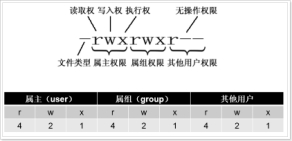

## linux常用命令
#### 系统目录  
/ 根目录  
/bin 存放必要的命令  
/boot 存放内核以及启动所需的文件  
/dev 存放设备文件  
/etc 存放系统配置文件  
/home 普通用户的宿主目录,用户数据存放在其主目录中  
/lib 存放必要的运行库  
/mnt 存放临时的映射文件系统,通常用来挂载使用  
/opt 存放安装的外部软件  
/proc 存放存储进程和系统信息  
/root 超级用户的主目录  
/sbin super user存放系统管理程序  
/tmp 存放临时文件  
/usr 存放应用程序,命令程序文件、程序库、手册和其它文档  
/var 系统默认日志存放目录  
#### 开关机
shutdown -h now：立刻关机  
shutdown -h 5：5分钟后关机  
shutdown -r now/reboot：立刻重启  
shutdown -r 5：5分钟后重启
#### 文件操作
ll -a：查看隐藏内容
ll -i：显示索引和文件
ll -n：显示文件uid和gid
ll -ltr：按时间顺序倒叙显示文件列表
ll -h：自动适应文件大小,友好显示：K、M、G
ll --version：查看版本号
history  n：查看最近n条历史操作记录,最多100条;!478  重新执行第478条记录
mkdir -p a/b/c：级联创建
rmdir -p a/b/c：递归删除(先删里面,再删外面)
echo：显示一行文本
touch：新建一个空文件 touch a.txt
which：显示可执行程序路径   which ls   which cd 不行(cd不是可执行命令) 举例：which python
type：查看命令的类型   type ls
alias：用别名创建自己的命令  先用type查看一下命令是否已被占用
type foo显示没被占用,alias foo='cd /usr;ls;'随便写,再看type foo已被占用,unalias foo解绑
{}展开：echo number{1..100}   echo {a..z}  mkdir {2005..2015}-{01..12}
cat：显示文件内容
more：显示内容超过一个屏幕：空格翻页,回车下一行,q退出  
less：和more类似,并且可以用j向下移,k向上移  
more或less状态下,/word 向下搜索,?word向上搜索,多个word用n显示下一个  
head  a.txt：显示文件前10行  
tail  a.txt：显示文件后10行  
tail -n 100 a.txt：显示文件后100行  
tail -f catalina.log：动态显示文件后10行(文件是不断增加的)  
wc a.txt：显示3个数字分别是行数、单词数、字符数  
wc -l a.txt：统计行数  
wc -w a.txt  或者  cat a.txt | wc -w：统计单词数(去重)  
wc -c a.txt：统计字符数  
ls | wc -l：查看某个目录下有多少文件  
rm：删除文件  
rm -f：不询问直接删除  
rm -r a/b/c：递归删除  
rm -rf a/b/c：不询问递归删除  
rm -rf *：删除所有文件  
rm -rf /*：自杀  
find ./ -inum 123 -delete：可以删除rm删不掉的文件(i是文件索引)  
cp a.txt b.txt：将a.txt 复制为b.txt  
cp -r dir1 dir2：-r表示递归  
mv a.txt ../：将a.txt移动(剪切)到上一层目录  
mv a.txt b.txt：将a.txt重命名为b.txt  
压缩成.gz格式：gzip *** ***.gz  
gzip -c *** ***.gz(保留原文件)  
解压.gz格式文件：gunzip ***.gz ***  后面不能跟  |  grep  
gunzip -c ***.gz *** | grep '  ' (保留源文件,可以跟 | grep操作,相当于zcat ***.gz | grep ' ')  
vi没有颜色     vim有颜色  
3种模式：一般模式、编辑模式、命令行模式  
i 在当前光标所在处插入  I 在光标所在行前端添加  
a 光标所在的下一个字符处插入   A 光标所在行末尾添加  
o 光标所在的下一行插入  
正常退出  :q   保存后退出  :wq  不保存退出  :q!  
删除当前行 dd   替换当前字符  R(按住shift变大写)  
同时修改多个文件：m  
vim  a.txt  b.txt 用：w保存,然后：next或：prev切换到其他文件  
gg：顶部 shift+g：底部  
vim  -o  a.txt  b.txt  分屏显示  
Ctrl + b 上一页  Ctrl + f 下一页  
：set nu 显示行号  
：2,5 d 删除第2~5行的内容  
重定向：cat a.txt > b.txt   重定向(覆盖)  
       cat a.txt >> b.txt   重定向(追加)  
管道："|" 将一个命令的输出作为另一个命令的输入  
ifconfig | grep eth1 --color -B 10  
ls --help | more 分页查询  
cat access.log | grep '01/Jun/2016:10' > test.log   抽出某个时间段的日志记录  
&&命令执行控制：只有左边的命令返回true,&&右边的命令才会执行  
使用场景：启动tomcat后立刻查看tomcat日志  
sh startup.sh && tail -f ../logs/catalina.out  
echo $SHELL：显示当前shell环境变量的值  
set | tail -10 ：显示系统环境变量的最后10个      
sh -x test.sh ：执行shell脚本时,启动跟踪模式   
#### 进程相关
nohup ./aaa.sh &: 将该脚本放在后台执行,即使关闭当前终端也能继续运行  
jobs: 只能查看当前终端的后台运行任务jobnum,jobs -l可显示PID,jobs状态包括running/stopped/Terminated  +是当前任务/-是后一个任务  
ps -aux: 查看当前所有进程,a显示所有程序/u以用户为主的格式来显示/x显示所有程序不以终端机来区分  
kill %jobnum/%PID: 杀掉进程  
fg %jobnum: 将后台程序调至前台运行   
ctrl + z: 暂停某个前台运行的命令并放到后台    
bg %jobnum: 调出暂停的后台命令继续执行   
#### rpm    
rpm：包管理工具(q,i,e,u)  
参数：  
-q, --query                      查询  
-a, --all                        所有  
-i, --install                    install package(s)  
-v, --verbose                    provide more detailed output  
-h, --hash                       print hash marks as package installs (good with -v)  
-e, --erase                      erase (uninstall) package  
-U, --upgrade=<packagefile>+     upgrade package(s)  
--test                           安装测试,并不实际安装  
--nodeps                         忽略软件包的依赖关系强行安装/删除  
--force                          忽略软件包及文件的冲突  
示例：  
rpm -qa|grep -i mysql                              (查询,-i忽略大小写)  
rpm -ev MySQL-server-5.6.21-1.el6.x86_64           (删除)  
rpm -ev --nodeps mysql-libs-5.1.71-1.el6.x86_64    (忽略依赖关系强行删除)  
rpm -ivh file.rpm                                  (显示安装进度 )  
rpm -Uvh file.rpm                                  (升级安装包)  

#### 网络通讯命令  
ifconfig  显示网络设备  
ifconfig eth0 up  启用eth0网卡  
ifconfig eth1 down  停用eth1网卡  
ping www.baidu.com  看网络是否通畅  
ps -ef：查看进程   ps -ef | grep java：查看进程中的Java程序  
ps -aux | grep redis：查看进程  
netstat -an：查看端口   netstat -an | grep 22：查看22端口占用情况  
netstat -rn：查看路由表  
kill xxx  杀掉某个进程   kill -9 xxx  强制杀掉进程  
网络配置：  
ping -c 5 www.baidu.com ：查看是否联网(-c 5 表示发送5个数据包)  
netstat ：查看本机网络连接状态  
netstat -nr / route：查看路由信息  
Ifconfig eth0 ：查看网络接口    ifup eth0 ：启用网络接口     ifdown eth0 ：禁用网络接口  

#### 系统管理命令    
at 8:30am ：输入内容,以Ctrl+D结束,表示希望在8:30执行一个定时任务  
atq ：查看任务等待队列  
echo " " > test.txt ：清空  
cal：显示日历 cal 2015 ：显示指定年份的日历  
date：显示当前系统时间  
date -R：显示时区  
date -s "2018-08-01 15:25:30"：设置系统时间  
hwclock -w：同步硬件时间  
ntpdate us.pool.ntp.org：使用ntp从时间服务器同步  
clear         清屏,其实没清,只是在上页看不到而已  
df -h         查看磁盘容量(-h表示系统自动调节合适的单位)  
du -h：查看当前目录下所有文件大小  
du -sh：查看当前目录总空间大小  
du -h --max-depth=0,1,2：查看不同深度目录大小,=0就相当于du -sh  
fdisk -l      显示磁盘信息  
fdisk -l /dev/sda1    查看分区设备,不加l则进入编辑模式  
free -m       以mb单位显示内存  
cat /proc/cpuinfo| grep "physical id"| sort| uniq| wc -l：查看物理CPU个数  
cat /proc/cpuinfo | grep "cpu cores" | uniq：查看每个物理CPU核数  
ps aux        查看内存占用情况  
who    显示登录用户信息  
finger -l cq  查看cq用户的详细登录信息  
hostname   显示主机名    修改主机名：vim /etc/sysconfig/network  
查看操作系统：cat /etc/issue    cat /etc/redhat-release  
查看系统位数：getconf LONG_BIT  
显示系统信息：uname  
显示本机详细信息：uname -a  
设置xxx开机自启动状态：chkconfig  xxx  on/off  
top   管理执行中的程序     按1切换cpu  

#### 用户和权限      
useradd test            添加test用户  
useradd test -d /home   指定用户home目录  
passwd                  不指定用户,就是设置root密码  
passwd test             为test用户设置密码  
userdel test            删除test用户  
userdel -r test         删除用户及home目录  
echo $LOGNAME           查看当前登录用户  
su test                 切换到test用户环境  
groupadd public        创建一个名为public的组  
useradd test -g public 创建test用户并指定组为public  
groupdel public        删除组,如果该组有用户成员,必须先删除用户才能删除组  
id test                查看test用户的UID、GID、组  
  
chmod 755 a.txt        更改对文件的读写执行权限  
chmod +x test.sh       给脚本赋予执行权限  
chown root test        将test目录所属的人改为root,组不变  
chown root:root test   将test目录所属的人和组都改为root  
chown -R root test     将test及其下所有子目录所属人都改为root(级联)   

#### $  
$0 这个程序的执行名字  
$n 这个程序的第n个参数值,n=1..9  
$* 这个程序的所有参数,此选项参数可超过9个  
$@ 跟$*类似,但是可以当作数组用  
$# 这个程序的参数个数  
$$ 这个程序的PID(脚本运行的当前进程ID号)  
$! 执行上一个背景指令的PID(后台运行的最后一个进程的进程ID号)  
$? 执行上一个指令的返回值 (0表示正常)  
$- 显示shell使用的当前选项,与set命令功能相同  
#### test  
test file1 –ef file2    两个文件是否为同一个文件,可用于硬连接。主要判断两个文件是否指向同一个inode。  
test file1 –nt file2    判断文件1是否比文件2新  
test file1 –ot file2    判断文件1比是否文件2旧  
test –b file            文件是否块设备文件  
test –c file            文件并且是字符设备文件  
test –d file            文件并且是目录  
test –e file            文件是否存在 (常用)  
test –f file            文件是否为正规文件 (常用)  
test –g file            文件是否是设置了组id  
test –G file            文件属于的有效组ID  
test –h file            文件是否是一个符号链接(同-L)  
test –k file            文件是否设置了Sticky bit位  
test –b file            文件存在并且是块设备文件  
test –L file            文件是否是一个符号链接(同-h)  
test –o file            文件的属于有效用户ID  
test –p file            文件是一个命名管道  
test –r file            文件是否可读  
test –s file            文件是否是非空白文件  
test –t FD              文件描述符是在一个终端打开的  
test –u file            文件存在并且设置了它的set-user-id位  
test –w file            文件是否存在并可写  
test –x file            文件属否存在并可执行  
#### iconv  
iconv：转换文件编码方式  
格式：iconv [option] file  
option可选参数：  
-l  --list                   列举所有字符集  
-f  --from-code=NAME         修改前编码  
-t  --to-code=NAME           修改后编码  
-c                           从输出中忽略无效的字符  
-o  --output=file            输出文件  
-s  --silent                 安静模式  
    --verbose                打印进度信息  
-?  --help                   给出该系统求助列表  
    --usage                  给出简要的用法信息  
-V  --version                打印程序版本号  
#### stat  
stat：显示文件的i节点信息  
文件的3个时间戳：  
Access time(atime)：  读取操作 cat、cp、grep、sed、more、less、tail、head 等命令会改变这个时间;  
Modify time(mtime)：  修改操作 vim 会改变这个时间,ll看到的也是这个时间;  
Change time(ctime)：  修改文件属性或位置 chmod、chown、mv等命令会改变这个时间;  
