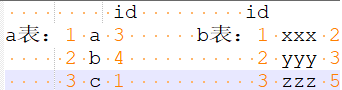

## hive表基本操作
[参考文档](http://www.cnblogs.com/hpucode/p/5204871.html)  
- 查看hive版本：hive --version
- 删除库：drop database test cascade(加cascade可以删除含有表的数据库)
- 模糊搜索表：show tables like '*name*'  
- 删除表：drop table table_name  
- 查看表详细信息：desc formatted table_name / show create table table_name    
- 添加新字段：alter table test add columns(order_id int comment '订单id')  
<font color=red>注意：添加新字段后要将原来已经存在的分区先删掉,不然数据加载不进去,如果要调整新字段顺序,可以再用change</font>    
- 修改表字段：alter table test change column column1 column2 string comment '...' first|after column3  
- 删除字段：alter table test replace columns(id int,name string)  
只保留需要的列,不需要的列删掉,同时也可以更换列的顺序(万能版)  
- 删除表分区：  
alter table test drop partition (dt=20160101)  -- 删除单个分区  
alter table test drop partition (dt>=20160101,dt<20170101) -- 删除条件范围内的多个分区  
或者直接去hdfs上删除存储数据的目录(表的分区还在,只是没有数据)  
- 重命名表：alter table table1 rename to table2  
- 复制表结构：create table empty_table1 like table1  
- 查看分区信息：show partitions table_name  
- 查看最小分区：select min(dt) from table_name;
- 查看执行计划：在sql前面加上explain  
- set hive.cli.print.header=true;在输出结果最上面一行打印列名  
- 导出hive数据到本地：hive -e "select * from test;" > /opt/aaa.txt -- (insert overwrite慎用,会覆盖整个目录!)  
- 往mysql插入大量数据：  
load data local infile '<c://users/grubby/desktop/test.txt>' replace into table test 	-----覆盖  
load data local infile '<c://users/grubby/desktop/test.txt>' into table test          -----追加  
- show functions：查找所有函数  
- desc function parse_url：查看某个函数  
- desc function extended parse_url：查看某个函数使用案例  
- 创建视图：create view view01 as select * from debit_ifno where dt=regexp_replace(date_sub(current_date,1),'-','')  
- 注册udf：  
将开发的udf打成jar包,上传到hdfs指定目录,然后创建函数  
create function default.url_decode as 'com.qbao.udf.decodeurl' using jar '<hdfs:///lib/decodeurl.jar>';  
## hive表数据加载方式
- 方式一：从本地/hdfs目录加载  
load data <font color=red>[local]</font> inpath '...' <font color=red>[overwrite]</font> into table t1 <font color=red>[partition(...)]</font>      
local表示从linux磁盘加载,否则是从hdfs的某个目录移动到hive表(/user/hive/flume/dt=20170101/...)  
overwrite覆盖/into追加  
- 方式二：select查询方式  
insert overwrite/into table t1 select * from t2;  
分区表略复杂: insert overwrite t1(dt=20160412) select stat_date,user_id,spu_name from t2 where dt=20160412;  
 (注意：不能用select *,因为分区也是一列,一开始建的是空表没数据,会报错说column数量不一致)  
```sql
-- 业务需求: mysql表很大,现在要抽到hive按天分区,保留2016年后的数据,2016年以前的数据都放到20151231这个分区里
-- 解决方法: 先将全量数据导入到temp的临时表(不分区),然后使用动态分区插入到ods层的分区表中
-- 注意: 动态分区的字段一定位于其他各个字段的最后
set hive.exec.dynamic.partition=true;
set hive.exec.dynamic.partition.mode=nonstrict;       -- 设置允许动态分区 
set hive.optimize.sort.dynamic.partition=true;        -- 设置动态分区排序优化 
set hive.exec.max.dynamic.partitions=10000;            -- 总共的最大动态分区数  
set hive.exec.max.dynamic.partitions.pernode=10000;    -- 每个节点能生成的最大分区数  
insert overwrite table ods.tickets_order partition(dt)
select *,  
       case when create_time >= '2016-01-01' then regexp_replace(substr(create_time,0,10),'-','') else 20151231 end
from temp.tickets_order;
```
- 方式三：  
使用单个查询语句创建表并加载数据(只能是内部表)  
create table t2 as     
select ... from t1 where ...;  
- hive命令行：  
-d,–define <key=value> 			//定义一个变量值,这个变量可以在hive交互shell中引用;比如：-d a=b  
–database <databasename> 	    //进入hive交互shell时候指定数据库,默认进入default数据库  
-e <quoted-query-string> 	    //命令行执行一段sql语句  
-f <filename> 	                //filename文件中保存hql语句,执行其中的语句  
-h,–help 	                	//显示帮助信息  
-h <hostname> 	                //连接远程hive server  
–hiveconf <property=value> 	    //在命令行中设置hive运行时配置参数,优先级高于hive-site.xml,但低于hive交互shell中使用set命令设置  
–hivevar <key=value> 	        //类似define  
-i <filename> 	                //进入hive交互shell时候先执行filename中的hql语句  
-p <port> 	                    //连接远程hive server的端口号  
-s,–silent 	                    //静默模式,指定后不显示执行进度信息,最后只显示结果  
-v,–verbose 	                //冗余模式,额外打印出执行的hql语句  

- hive交互shell：  
hive> !pwd;                     //执行linux操作系统命令  
/home/test  
hive> dfs -du -s /tmp/;         //统计hdfs上/tmp/目录总大小  
54656194751 /tmp  
hive> set <key>=<value>         //设置hive运行时配置参数,优先级最高,相同key,后面的设置会覆盖前面的设置  
hive> set –v                   //打印出所有hive的配置参数和hadoop的配置参数  
hive> reset                     //重置所有的hive运行时配置参数,比如,之前使用set命令设置了reduce数量,使用reset之后,重置成hive-site.xml中的配置  
hive> quit/exit                 //退出交互shel  
## hive表操作  
hive是把除select * 以外的所有sql都翻译成mapreduce程序在yarn集群里跑,由于加载shuffle等耗时较长,实际数据运算是很快的,当查询大量数据的时候就看出效果来了！  
- 内部表  
创建内部表：  
hive>create table inner_tab(dt string,websession string,word string,s_seq int,c_seq int,website string) row format delimited fields terminated by '\t' lines terminated by '\n' ;  
(内部表路径默认存放在hdfs的/user/hive/warehouse下,并且还会生成一个tmp目录)  
1、从本地加载数据  
hive>load data local inpath '/home/cq/sogouq2.txt' into table inner_tab;  
2、从hdfs加载数据(剪切)  
hive>load data inpath '...' into table inner_tab;  
写hql查询：(可以通过8088端口查看yarn集群上application的运行情况)  
hive>select count(1) from inner_tab;  
hive>select count(1) from inner_tab where website like '%baidu%';  
  
- 外部表  
创建外部表：  
hive>create external table external_tab(dt string,websession string,word string,s_seq int,c_seq int,website string) row format delimited fields terminated by '\t' lines terminated by '\n' stored as textfile location '/test/external_tab';  
(外部表路径是自定义的,可以事先在hdfs上创建好)  
从本地加载数据  
hive>load data local inpath '/home/cq/sogouq1.txt' into table external_tab;  

- 分区表(较常用)  
分区表：创建表的时候可以设置分区(分区表也分内部分区表和外部分区表,如果指定location就是外部分区表)  
优点：做一些子条件查询时只需处理一小个分区文件而不是很多文件  
创建分区表：
```sql
create table if not exists base.rec_spu_summary(  
sumary_date         string,  
user_id             int,  
spu_id_list         array<int>  
)  
partitioned by (dt string)  
row format delimited  
fields terminated by '\001'  
lines terminated by '\n'  
stored as textfile;  
参数说明:  
row format delimited  
fields terminated by '\001'  
collection items terminated by '\002'  
map keys terminated by '\003'  
stored as textfile;  
[row format delimited]: 设置创建的表在加载数据的时候,支持的列分隔符;不同列之间用一个'\001'分割,集合
(array,map)的元素之间以'\002'隔开,map中key和value用'\003'分割;  
[stored as file_format]: 设置加载数据的数据类型,默认是textfile,如果文件数据是纯文本,就是使用 [stored
as textfile],然后从本地直接拷贝到hdfs上,hive直接可以识别数据;  
```

1. 静态分区表：  
insert overwrite table ptable partition (daytime='20140909',city='bj') select id,name from ptabletmp where daytime='20140909' and city='bj';  
 
2. 动静结合分区表：  
开启动态分区：set hive.exec.dynamic.partition=true;  
创建表  
create table ptable2(id int,name string)  
partitioned by (daytime string,city string)  
row format delimited fields terminated by '\t'  
stored as textfile;  
插入数据  
insert overwrite table ptable2 partition(daytime='20140909',city) select id,name,city from ptabletmp where daytime='20140909';  
 
3. 动态分区表：  
开启多动态分区：set hive.exec.dynamic.partition.mode=nostrict;  
创建表  
create table ptable3(id int,name string)  
partitioned by (daytime string,city string)  
row format delimited fields terminated by '\t'  
stored as textfile;  
插入数据  
insert overwrite table ptable3 partition (daytime,city) select id,name,daytime,city from ptabletmp distribute by daytime,city;                               --动态分区的字段一定位于其他各个字段的最后  

- 桶表  
bucket是将表的列进行hash取值,根据hash值切分数据,目的是为了并行,每一个bucket对应一个文件。  
创建桶表：  
create table bucket_tab(id string) clustered by (id) into 4 buckets;  
加载数据  
设置自动适应,mapreduce会根据桶个数设置reduce个数：  
set hive.enforce.bucketing = true;可以自动控制上一轮reduce的数量从而适配bucket的个数,用户也可以自主设置mapred.reduce.tasks去适配bucket 个数,推荐使用'set hive.enforce.bucketing = true'   
导入数据：insert overwrite table btable select id from ptabletmp ;  
抽样查询：select * from btable tablesample(bucket 1 out of 4 on id);  

- hive表数据去重  
create table t2 like t1;  
insert overwrite table t2 select distinct * from t1;
## hive表join操作 
  
- 内连接：基于on语句,返回表1和表2符合链接条件的数据  
select * from a join b on(a.id = b.id);  
3   c   1   1   xxx 2  
1   a   3   3   zzz 5  
- 左连接：显示左表所有数据,右表没有的为null  
select * from a left join b on(a.id = b.id);  
1   a   3   3   zzz 5  
2   b   4   null    null    null  
3   c   1   1   xxx 2  
- 左半开连接：只显示左表数据,比左连接快  
select * from a left semi join b on(a.id = b.id);  
1   a   3  
3   c   1  
- 右连接：显示右表所有数据,左表没有的为null  
select * from a right join b on(a.id = b.id);  
3   c   1   1   xxx 2  
null    null    null    2   yyy 3  
1   a   3   3   zzz 5  
- 全连接：显示所有数据,匹配不到的为null  
select * from a full join b on(a.id = b.id);  
3   c   1   1   xxx 2  
null    null    null    2   yyy 3  
1   a   3   3   zzz 5  
2   b   4   null    null    null  
- 笛卡尔积：对每条数据做连接(3 * 3)  
select * from a join b;  
1   a   3   1   xxx 2  
2   b   4   1   xxx 2  
3   c   1   1   xxx 2  
1   a   3   2   yyy 3  
2   b   4   2   yyy 3  
3   c   1   2   yyy 3  
1   a   3   3   zzz 5  
2   b   4   3   zzz 5  
3   c   1   3   zzz 5  
## hive分组排序
- sort by和order by  
sort by：  分区内排序,即每个reduce任务内排序;  
order by：全局排序,就是对指定的所有排序键进行全局排序,使用order by的查询语句,最后会用一个  
                       reduce task来完成全局排序;  
hive> select * from test;  
ok  
5 3 6 2 9 8 1  
hive> select * from test order by id;  
1 2 3 5 6 8 9  
hive> set mapred.reduce.tasks=2;  
hive> select * from test sort by id;  
2 5 6 9 1 3 8  
设定了2个reduce,从结果可以看出,在每个reduce内都做了排序,如果reduce数为1,那么两者结果是一样的  

- distribute by和cluster by  
distribute by：按照指定的字段或表达式对数据进行划分,输出到对应的reduce或者文件中  
cluster by：除了兼具distribute by的功能,还兼具sort by的排序功能,且只能是降序  
hive> set mapred.reduce.tasks=2;  
hive>insert overwrite local directory '/tmp/test/'  select id from test distribute by id;  
执行后在本地的/tmp/test目录中生成了000000_0和000001_0两个文件：  
cat 000000_0  
8 2 6  
cat 000001_0 ##id%2=1的记录  
1 9 3 5  
hive> set mapred.reduce.tasks=2;  
hive> insert overwrite local directory '/tmp/test/'   
         select id from test  cluster by id;  
cat 000000_0  
2 6 8  
cat 000001_0  
1 3 5 9  
注意：使用cluster by之后,每个文件中的id都进行了排序,而distribute by没有  
## table
- hive内部表：
```sql
create table if not exists base.inner(  
json string  
)  
comment '内部表'  
partitioned by (dt string)  
row format delimited  
fields terminated by '\t'  
lines terminated by '\n'  
stored as orc tblproperties ("orcompress"="snappy");  
-- orcfile比rcfile在存储结构和存储空间上做了优化
```

- hive外部表
```sql
create external table if not exists base.external(
json string  
)  
comment '外部表'  
partitioned by (dt string)  
row format delimited  
fields terminated by '\t'  
lines terminated by '\n'  
stored as orc tblproperties ("orcompress"="snappy")  
location 'hdfs://nameservice1/user/flume/qbao_goods_stuff_log';
```

- mysql建表语句
```sql
create table if not exists app_v40_index_localtion_pvuv_sum (
	stat_date date not null comment '日期',  
	mobile_type varchar (20) not null default '' comment '手机类型',  
	position varchar (11) not null default '10000' comment '楼层',  
	floor_type varchar (16) not null comment '楼层',  
	field_tag varchar (50) not null comment '坑位',  
	horizontal_position varchar (11) not null default '',  
	pv int (11) default null,  
	uv int (11) default null,  
	ips int (11) not null default '0',  
	primary key (stat_date,position,field_tag,floor_type,mobile_type,horizontal_position)  
) engine = innodb default charset = utf8 comment='呵呵'  
```