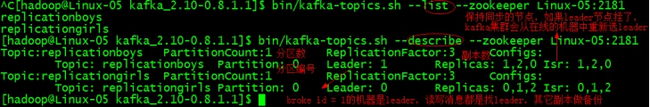
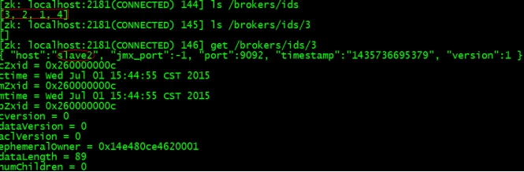
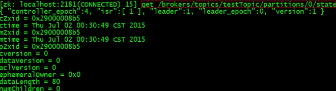
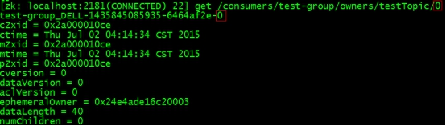
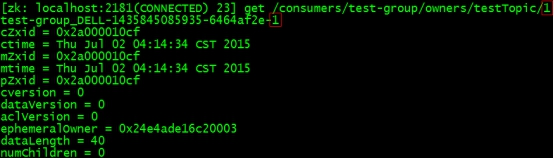
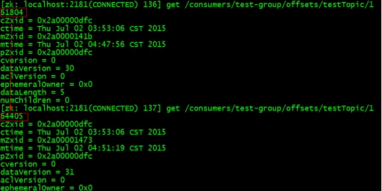

### kafka
```bash
# Kafka是基于发布-订阅模式的分布式消息队列,主要应用于大数据实时处理领域

# 消息队列两种模式
1.点对点模式(一对一)：一个消息只能被一个消费者消费,消费完就从queue从移除
2.发布-订阅模式(一对多)：生产者publish消息到topic,消费者subscribe该消息,一个消息会被多个消费者消费,消费完不会立马清除而是保存一段时间

# 消息队列应用场景
1.解耦：A系统生产数据通过接口调用发送到BCD系统,随着业务发展C不要了D挂了E又要了A要忙死...A将数据发送到MQ需要的自己去取,A不用考虑发给谁以及是否调用成功
2.异步：页面注册 - 写数据库 - 调用发短信接口(略耗时) - 响应用户   
       页面注册 - 写数据库 - 将发短信请求写入MQ - 响应用户(短信接口作为消费者会轮询MQ读取数据发送短信,用户不用等待这个操作消耗的时间)
3.削峰：秒杀系统会在短时间内产生大量请求,比如5K个/秒但是系统处理能力只有2K个/秒,大概率扛不住,可以将请求写入MQ,系统会按照自己的消费能力pull数据
       虽然在短时间内MQ会积压大量请求,但是高峰期过后请求会急剧减少,可能只有50个/秒,系统很快就会将积压的消息处理掉
       
# 消息队列和普通队列区别？
java提供了各种各样的队列类,但都是程序中基于内存的单机版队列,MQ通常是分布式队列并且数据可以持久化
java提供了HashMap存储key-value数据,但是很多时候还是会用到Redis(可以将数据持久化到磁盘,redis挂了可以从磁盘恢复)

# 消息队列缺点
为了保证消息队列的高可用就得使用分布式,为防止数据丢失还要考虑持久化,这些都会提高系统的复杂性

# kafka架构
producer：生产者,将消息发送到指定topic的partition
consumer：消费者,从topic中pull数据
consumer group：消费者组,由多个消费者组成,每个消费者负责消费不同分区的数据,消费者组是逻辑上的订阅者
broker：一个kafka节点就是哟个broker,集群由多个broker组成,一个broker可以容纳多个topic
topic：一个消息队列,生产者和消费者面向的都是topic
partition：为了实现扩展性,一个大的topic可以有多个partition,每个partition都是有序队列,一个partition只能对应一个消费者
          每个partition对应一个log文件,producer生产的数据会不断追加到log文件末尾,且每条数据都有自己的offset便于定位,offset保存在kafka的内置topic __consumer_offsets
segment：为了防止log文件过大导致数据定位效率低下,kafka采用分片和索引机制,将partition分为多个segment,每个segment对应'.index'和'.log'两个文件
         '.index'存储索引信息,'.log'存储数据,index和log文件以当前segment的第一条消息的offset命名
replication：为了保证HA,每个partition都有副本,一个leader(生产者发送数据和消费者消费数据的对象)和多个follower(从leader同步数据,leader故障时会选取某个follower成为新的leader)
offset：消息的偏移量,以消费者组为单位进行维护,如果以消费者为单位维护的话,其中某个消费者挂掉了那么这个offset就丢失了
       当partition或consumer数量发生变化时,会触发kafka的rebalance机制重新分配分区,这对消费者组并没有影响,所以offset是以消费者组为单位维护

# zk在kafka中的作用
kafka集群中有一个broker会被选举为Controller,负责管理broker上下线/topic的分区副本分配/leader选举等工作,这些都依赖于zk

# partition的分配策略：确定哪个partition由哪个consumer消费
roundrobin：先按照每个partition的hash值排序,然后轮询分配给consumer
range：针对partition和consumer的个数按照范围分配

# kafka高低阶消费者？

# kafka如何保证数据可靠性？

```

### install
```bash
# 修改配置文件
[root@master1 ~]# vim server.properties
# broker的全局唯一编号,不能重复
broker.id=0
# 开启删除topic功能,否则只是标记删除并没有真正删除
delete.topic.enable=true
# 处理网络请求的线程数
num.network.threads=3
# 处理磁盘io的线程数
num.io.threads=8
# 发送套接字的缓冲区大小
socket.send.buffer.bytes=102400
# 接收套接字的缓冲区大小
socket.receive.buffer.bytes=102400
# 请求套接字的缓冲区大小
socket.request.max.bytes=104857600
# kafka运行日志存放路径
log.dirs=/opt/module/kafka/logs
# topic在当前broker上的分区个数
num.partitions=1
# 恢复和清理data下数据的线程数
num.recovery.threads.per.data.dir=1
# segment文件保留的最长时间,超时将被删除
log.retention.hours=168
# 配置Zookeeper地址
zookeeper.connect=cdh1:2181,cdh2:2181,cdh3:2181

[root@master1 ~]# vim /etc/profile && source /etc/profile
export KAFKA_HOME=/opt/module/kafka
export PATH=$PATH:$KAFKA_HOME/bin

# 分发到其他节点
scp -r kafka cdh2:/opt/module/kafka && broker.id=2
scp -r kafka cdh3:/opt/module/kafka && broker.id=3

# 启动kafka
[root@master1 ~]# cd /usr/bin -> vim start-kafka -> chmod +x start-kafka
#!/bin/bash
for i in cdh1 cdh2 cdh3
do
    echo ==================== ${i} ====================
    # ssh后面的命令是未登录执行,需要先刷新系统环境变量
    ssh ${i} "source /etc/profile && zkServer.sh start"
    ssh ${i} "source /etc/profile && cd /opt/module/kafka && bin/kafka-server-start.sh -daemon config/server.properties &"
    echo ${?}
done

# 查看topic列表
[root@master1 ~]# bin/kafka-topics.sh --zookeeper cdh1:2181 --list
# 创建topic
[root@master1 ~]# bin/kafka-topics.sh --zookeeper cdh1:2181 --create --replication-factor 3 --partitions 1 --topic test
# 查看topic详细信息
[root@master1 ~]# bin/kafka-topics.sh --zookeeper cdh1:2181 --describe --topic test
# 修改topic分区数
[root@master1 ~]# bin/kafka-topics.sh --zookeeper cdh1:2181 --alter --topic test --partitions 2
# 往topic发送消息
[root@master1 ~]# bin/kafka-console-producer.sh --broker-list cdh1:9092 --topic test
# 从topic消费消息
[root@master1 ~]# bin/kafka-console-consumer.sh --bootstrap-server cdh1:9092 --from-beginning --topic test
# 删除topic
[root@master1 ~]# bin/kafka-topics.sh --zookeeper cdh1:2181 --delete --topic test
 ```
 
  
  

### kafka api
```java
public class ProducerDemo {  
    public static void main(String[] args) throws Exception {  
        //新建属性  
        Properties prop = new Properties();  
        //添加连接的zookeeper  
        prop.put("zookeeper.connect", "centos01:2181,centos02:2181,centos03:2181");  
        //添加kafka服务器列表  
        prop.put("metadata.broker.list", "centos01:9092,centos02:9092,centos03:9092");  
        //添加数据的序列化类  
        prop.put("serializer.class", "kafka.serializer.StringEncoder");  
        //新建producer配置信息  
        ProducerConfig config = new ProducerConfig(prop);  
        //创建producer  
        Producer<String,String> producer = new Producer<String,String>(config);  
        //生产消息  
        for (int i = 0; i < 100; i++) {  
            //设置线程休眠时间（不然会一直不停的发）  
            Thread.sleep(100);  
            //发送消息  
            producer.send(new KeyedMessage<String,String>("replicationgirls", "hehe"+i));  
        }  
    }  
}  

public class ConsumerDemo {  
    public static void main(String[] args) {  
        //新建属性  
        Properties prop = new Properties();  
        //添加zookeeper连接  
        prop.put("zookeeper.connect", "centos01:2181,centos02:2181,centos03:2181");  
        //添加group  
        prop.put("group.id", "001");  
        //添加offset（kafka支持从指定偏移量读取消息）  
        prop.put("auto.offset.reset", "smallest");  
        //新建consumer配置信息  
        ConsumerConfig config = new ConsumerConfig(prop);  
        //API编写入口  
        ConsumerConnector consumer = Consumer.createJavaConsumerConnector(config);  
        //用map集合封装多个topic：String表示topic名称，Integer表示线程数  
        HashMap<String,Integer> map = new HashMap<String,Integer>();  
        map.put("replicationgirls", 3);  
        map.put("replicationboys", 2);  
        map.put("replicationstudents", 1);  
        //创建消息流：String表示topic名称，List有多个线程在跑这个消息流  
        Map<String,List<KafkaStream<byte[],byte[]>>> MessageStreams = consumer.createMessageStreams(map);
        //获取指定topic的streams：两个byte[]分别表示消息体和消息内容  
        List<KafkaStream<byte[], byte[]>> streams = MessageStreams.get("replicationgirls");  
        //遍历循环streams，有几个kafkaStream就new几个线程  
        for (final KafkaStream<byte[], byte[]> kafkaStream : streams) {  
            new Thread(new Runnable() {  
                @Override  
                public void run() {  
                    //遍历每个kafkaStream，获取message和metadata  
                    for (MessageAndMetadata<byte[], byte[]> mm : kafkaStream) {  
                        //获取message  
                        String msg = new String(mm.message());  
                        //接下来是数据处理的业务逻辑  
                        System.out.println(msg);  
                    }  
                }  
            }).start();  
        }  
    }  
}  
```

### zookeeper监控
kafka启动时会在zookeeper上创建brokers节点和consumers节点。  
    
ids：监控broker是否存活     格式: /brokers/ids/[0...N]    
  
topics：查找partition在哪台broker上     格式: /brokers/topics/[topic]/partitions/[0...N]   
  
  
owners：标记partition被组内哪个consumer消费.临时znode。  
格式: /consumers/[group_id]/owners/[topic]/[broker_id-partition_id]  
    
    
ids：记录该组中的consumer消费的topic的partition个数  
格式: /consumers/[group_id]/ids/[consumer_id]  
  
offsets：跟踪每个consumer组目前所消费的partition中最大的offset。    
格式: /consumers/[group_id]/offsets/[topic]/[broker_id-partition_id]  
  
