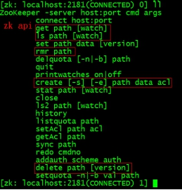
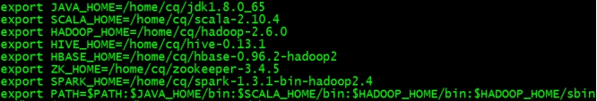
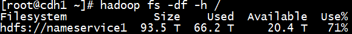
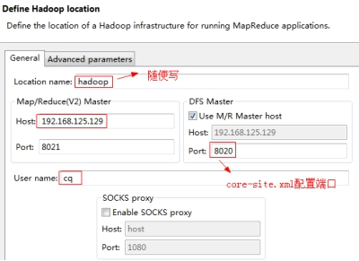
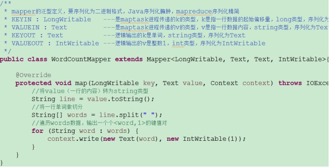
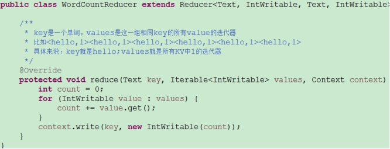

## <font color=red>Zookeeper</font>    
zookeeper是一个分布式应用程序协调服务  
HA特点：  
共享存储  
——解决单点故障  
——利用QJM保存Editlog  
——保证数据一致性  
FailoverController  
——ZKFC控制  
——避免NN GC时的心跳暂停  
Fencing  
——防止脑裂split-brain(2个NN，只有一个主，对外发号施令，另一个是从，做备份)  
hadoop2.x提供了两种HDFS HA的解决方案，一种是NFS，另一种是QJM，这里我们使用简单的QJM。在该方案中，主备NameNode之间通过一组JournalNode同步元数据信息，一条数据只要成功写入多数，JournalNode即认为写入成功，通常配置奇数个JournalNode。这里还配置了一个zookeeper集群，用于ZKFC( DFSZKFailoverController)故障转移，当Active NameNode挂掉了，会自动切换Standby 为Active；  
hadoop-2.4.1以后Yarn也有两个ResourceManager，一个Active，一个Standby，状态由zookeeper协调；  
Zookeeper是由一个leader，多个follower组成的集群  
一致性：每个server都保存一份相同的数据副本，client无论连接到哪个server，数据都一致  
原子性：一次数据更新要么都成功，要么都失败  
实时性：在一定时间范围内，client能读到最新数据  
1、在centos01上安装zooekeeper<font color=blue>(每次都要先启动zookeeper，hdfs和yarn都依赖zk管理)</font>
tar -zxvf zookeeper-3.4.5.tar.gz  
修改zoo.cfg  
tickTime：CS通信心跳时间  
Zookeeper服务器或客户端与服务器之间维持心跳的时间间隔，每隔tickTime 发送一个心跳，以毫秒为单位。  
tickTime=2000  
initLimit：LF初始通信时限  
集群中的leader服务器(L)与follower服务器(F)之间，初始连接时能容忍的最多心跳数(tickTime的数量)。  
initLimit=10  
syncLimit：LF同步通信时限  
集群中的leader服务器与follower服务器之间，请求和应答之间能容忍的最多心跳数(tickTime的数量)。  
syncLimit=5  
dataDir：数据文件目录  
Zookeeper保存数据的目录，默认情况下，Zookeeper将写数据的日志文件也保存在这个目录里。  
dataDir=/home/cq/zookeeper-3.4.5/data  
clientPort：客户端连接端口  
客户端连接 Zookeeper 服务器的端口，Zookeeper 会监听这个端口，接受客户端的访问请求。  
clientPort=2181  
服务器名称与地址：集群信息(服务器编号，服务器地址，LF通信端口，选举端口)  
server.1=centos01:2888:3888  
server.2=centos02:2888:3888  
server.3=centos03:2888:3888  
然后创建一个data文件夹  
mkdir /home/cq/zookeeper-3.4.5/data  
echo 1 > myid  
2、将配置好的zookeeper拷贝到其他节点  
scp -r /home/cq/zookeeper-3.4.5/ centos02:/home/cq  
scp -r /home/cq/zookeeper-3.4.5/ centos03:/home/cq  
分别修改myid值为2和3  
3、zookeeper命令行操作  
启动：zkServer.sh start  
查看状态：zkServer.sh status  
进入当前这台机：zkCli.sh  
进入指定ip的客户端：zkCli.sh –server <ip>    
  
zookeeper选举机制  
全新集群：比较myid(半数机制)  
非全新集群(有机器中途宕机)：先看谁数据最新，再比较myid  
层次化的目录结构，每个节点在zookeeper中叫做znode，节点znode可以包含数据和子节点  
znode有两种类型：  
短暂(ephemeral)(断开连接自己删除)  
持久(persistent)(断开连接不删除)  
znode有四种目录节点：(默认持久非序列化)  
PERSISTENT  
PERSISTENT_SEQUENTIAL(持久序列化/test0000000019)  
EPHEMERAL  
EPHEMERAL_SEQUENTIAL  
## Hadoop2.4.1  
1、在centos01上安装hadoop  
tar -zxvf hadoop-2.4.1.tar.gz  
修改环境变量：vi /etc/profile  
  
修改hadoo-env.sh  
export JAVA_HOME=/home/cq/jdk1.8.0_65  
修改core-site.xml  

```angular2html
<configuration>  
<!-- 指定hdfs的nameservice为ns1 -->  
<property>  
<name>fs.defaultFS</name>  
<value>hdfs://ns1/</value>  
</property>  
<!-- 指定hadoop临时目录 -->  
<property>  
<name>hadoop.tmp.dir</name>  
<value>/home/hadoop/hadoop-2.4.1/tmp</value>  
</property>  
<!-- 指定zookeeper地址 -->  
<property>  
<name>ha.zookeeper.quorum</name>  
<value>Linux-05:2181,Linux-06:2181,Linux-07:2181</value>  
</property>  
</configuration>  
修改hdfs-site.xml  
<configuration>  
<!--指定hdfs的nameservice为ns1，需要和core-site.xml中的保持一致 -->  
<property>  
<name>dfs.nameservices</name>  
<value>ns1</value>  
</property>  
<!-- ns1下面有两个NameNode，分别是nn1，nn2 -->  
<property>  
<name>dfs.ha.namenodes.ns1</name>  
<value>nn1,nn2</value>  
</property>  
<!-- nn1的RPC通信地址 -->  
<property>  
<name>dfs.namenode.rpc-address.ns1.nn1</name>  
<value>Linux-01:9000</value>  
</property>  
<!-- nn1的http通信地址 -->  
<property>  
<name>dfs.namenode.http-address.ns1.nn1</name>  
<value>Linux-01:50070</value>  
</property>  
<!-- nn2的RPC通信地址 -->  
<property>  
<name>dfs.namenode.rpc-address.ns1.nn2</name>  
<value>Linux-02:9000</value>  
</property>  
<!-- nn2的http通信地址 -->  
<property>  
<name>dfs.namenode.http-address.ns1.nn2</name>  
<value>Linux-02:50070</value>  
</property>  
<!-- 指定NameNode的元数据在JournalNode上的存放位置 -->  
<property>  
<name>dfs.namenode.shared.edits.dir</name>  
<value>qjournal://Linux-05:8485;Linux-06:8485;Linux-07:8485/ns1</value>  
</property>  
<!-- 指定JournalNode在本地磁盘存放数据的位置 -->  
<property>  
<name>dfs.journalnode.edits.dir</name>  
<value>/home/hadoop/hadoop-2.4.1/journaldata</value>  
</property>  
<!-- 开启NameNode失败自动切换 -->  
<property>  
<name>dfs.ha.automatic-failover.enabled</name>  
<value>true</value>  
</property>  
<!-- 配置失败自动切换实现方式 -->  
<property>  
<name>dfs.client.failover.proxy.provider.ns1</name>
<value>org.apache.hadoop.hdfs.server.namenode.ha.ConfiguredFailoverProxyProvider</value>
</property>  
<!-- 配置隔离机制方法，防止脑裂split-brain-->  
<property>  
<name>dfs.ha.fencing.methods</name>  
<value>  
sshfence  
shell(/bin/true)  
</value>  
</property>  
<!-- 使用sshfence隔离机制时需要ssh免登陆 -->  
<property>  
<name>dfs.ha.fencing.ssh.private-key-files</name>  
<value>/home/hadoop/.ssh/id_rsa</value>  
</property>  
<!-- 配置sshfence隔离机制超时时间 -->  
<property>  
<name>dfs.ha.fencing.ssh.connect-timeout</name>  
<value>30000</value>  
</property>  
</configuration>  
修改mapred-site.xml  
<configuration>  
<!-- 指定mr框架为yarn方式 -->  
<property>  
<name>mapreduce.framework.name</name>  
<value>yarn</value>  
</property>  
</configuration>  
修改yarn-site.xml  
<configuration>  
<!-- 开启RM高可用 -->  
<property>  
   <name>yarn.resourcemanager.ha.enabled</name>  
   <value>true</value>  
</property>  
<!-- 指定RM的cluster id -->  
<property>  
   <name>yarn.resourcemanager.cluster-id</name>  
   <value>yrc</value>  
</property>  
<!-- 指定RM的名字 -->  
<property>  
   <name>yarn.resourcemanager.ha.rm-ids</name>  
   <value>rm1,rm2</value>  
</property>  
<!-- 分别指定RM的地址 -->  
<property>  
   <name>yarn.resourcemanager.hostname.rm1</name>  
   <value>Linux-03</value>  
</property>  
<property>  
   <name>yarn.resourcemanager.hostname.rm2</name>  
   <value>Linux-04</value>  
</property>  
<!-- 指定zk集群地址 -->  
<property>  
   <name>yarn.resourcemanager.zk-address</name>  
   <value>Linux-05:2181,Linux-06:2181,Linux-07:2181</value>  
</property>  
<property>  
   <name>yarn.nodemanager.aux-services</name>  
   <value>mapreduce_shuffle</value>  
</property>  
</configuration>  
```  
修改slaves  
centos01  
centos02  
centos03  
配置ssh免密登录  
在centos01上生产一对钥匙：ssh-keygen -t rsa  
将公钥拷贝到其他节点，包括自己  
ssh-coyp-id centos01  
ssh-coyp-id centos02  
ssh-copy-id centos03  
将配置好的hadoop拷贝到其他节点(将share下的doc删掉  不然很慢)  
scp -r hadoop-2.4.1/ centos02:/home/cq  
scp -r /etc/profile centos02:/etc/profile  
。。。。  
启动集群：(严格按照下面的步骤)  
启动zk：zkServer.sh start  
启动journalnode：hadoop-daemon.sh start journalnode(每台都要启)  
格式化HDFS：hdfs namenode -format  
把tmp拷到nn2下面  
scp -r hadoop-2.4.1/tmp centos02:/home/cq/hadoop-2.4.1  
格式化ZKFC：hdfs zkfc -formatZK  
启动HDFS：start-dfs.sh  
启动Yarn：start-yarn.sh     centos02要手动启：yarn-daemon.sh start resourcemanager  
WebUi页面监控：  
http://centos01:50070(hdfs)  
http://centos02:50070  
http://centos01:8088(mapreduce)  
测试集群状态：  
hdfs dfsadmin -report    查看hdfs的各节点状态信息  
hdfs dfsadmin -safemode    查看hdfs是否以安全模式运行  
hdfs haadmin -getServiceState nn1     获取一个namenode节点的HA状态(active/standby)  
hdfs haadmin -failover nn1 nn2           切换状态(注意顺序：这里是将nn2变为active)  
hdfs haadmin -checkHealth nn1            检测节点健康状况  
hadoop-daemon.sh start zkfc     单独启动一个zkfc进程  
yarn application -list                    查看yarn程序状态  
yarn application -kill ***                 杀掉yarn进程  
## <font color=red>Hdfs</font>   
查看帮助：hadoop fs -help <cmd>  
查看文件列表：hadoop fs -ls /  
查看文件内容：hadoop fs -cat <hdfs上的路径>  
上传：hadoop fs -put <Linux-上文件> <hdfs上的路径>  
下载：hadoop fs -get <hdfs上的路径> <Linux-上文件>  
创建文件夹(级联)：hadoop fs -mkdir -p <path>  
在hdfs上移动文件：hadoop fs -mv /aaa/*  /bbb/  
删除hdfs文件：hadoop fs -rm /aaa/angela.txt  
删除hdfs文件夹：hadoop fs -rm -r /aaa  
查看hdfs总空间大小：hadoop fs -df -h /  
  
查看hdfs某个目录大小：hadoop fs -du -s -h /user/hive/warehouse  
    
查看hdfs某个目录下所有文件大小：hadoop fs -du -h /user/root/.Trash/Current/user/hive/warehouse  
      
## <font color=red>Trash</font>   
hadoop的回收站trash默认是关闭的，还是打开比较好，防止误删数据  
修改core-site.xml  
```xml
<property>  
<name>fs.trash.interval</name>  
<value>1440</value>  
<description>文件删除后保留时长(分钟)，默认是0，表示关闭回收站</description>  
</property>  
```  
和Linux系统回收站一样，HDFS会为每个用户创建一个回收站目录：/user/用户名/.Trash/，在HDFS内部的具体实现就是在NameNode中开启一个后台线程Emptier，这个线程专门管理和监控系统回收站，将超过生命周期的数据删除并释放关联的数据块，但是在文件被删除和hdfs磁盘空间增加之间会有一个等待时间延迟；  
通过命令删除的文件并没有立刻从HDFS中清除，而是转移到回收站/user/hdfs/.Trash/Current(hdfs是当前用户)，可以通过mv操作恢复数据；如果回收站中文件已经存在，则HDFS会将这个文件重命名，命名规则是在文件后面紧跟一个编号(从1开始直到没有重名为止)；  
手动清空回收站：hadoop fs -expunge，先将当前回收站目录/user/用户名/.Trash/current重命名为：/user/用户名/.Trash/yyMMddHHmmss(当前系统时间，精确到秒)，再次执行清空回收站操作，就彻底删除了；  
## <font color=red>MapReduce</font>  
- Eclipse安装hadoop插件  
  
下载对应hadoop版本的插件：  
将hadoop-eclipse-plugin-2.6.0.jar放到eclipse的plugins目录下，重启eclipse  
然后将hadoop2.6解压到本地，将hadoop.dll和winutils.exe放到hadoop的bin目录下  
设置Window->Prefrences->Hadoop Map/Reduce的installation directory  
设置Window->Open Perspective->Other->Map/Reduce  
创建hdfs连接：  
  
能看到DFS Locations下的hdfs目录说明插件安装成功。  
常见错误：  
Permission denied: user=admin, access=EXECUTE, inode="/user":cq:supergroup:drwxrwx---  
权限不足，配置本地环境变量HADOOP_USER_NAME  cq(Hdfs上对/user路径有读、写、执行权限的用户)  
或者：hadoop fs -chmod 777 /user  
Maven构建hadoop项目  
配置系统环境变量：HADOOP_HOME、MAVEN_HOME  
进入eclipse工作目录，Shift+右键打开黑窗口，  
mvn archetype:generate -DarchetypeGroupId=org.apache.maven.archetypes -DgroupId=com.qbao.hadoop -DartifactId=hadoop -DpackageName=com.qbao.hadoop -Dversion=1.0-SNAPSHOT -DinteractiveMode=false  
Build Success;  
cd hadoop(项目名称);  
mvn clean install  
Build Success;  
然后将maven project导入eclipse，修改pom.xml,添加依赖  
```
<dependency>  
    <groupId>org.apache.hadoop</groupId>  
    <artifactId>hadoop-common</artifactId>  
    <version>2.6.0</version>  
</dependency>  
<dependency>  
    <groupId>org.apache.hadoop</groupId>  
    <artifactId>hadoop-hdfs</artifactId>  
    <version>2.6.0</version>  
</dependency>  
<dependency>  
    <groupId>org.apache.hadoop</groupId>  
    <artifactId>hadoop-client</artifactId>  
    <version>2.6.0</version>  
</dependency>  
```
将core-site.xml、hdfs-site.xml、mapred-site.xml复制到src/main/resources目录下  
接下来可以开发mapreduce程序了  
- WC案例  
```java

public class WordCount {  
    public static class WordCountMapper extends Mapper<LongWritable, Text, Text, IntWritable>{  
        private final static IntWritable one = new IntWritable(1);  
        private Text text = new Text();  
        @Override  
        protected void map(LongWritable key, Text value, Context context) throws IOException, InterruptedException {  
            String line = value.toString();  
            String[] words = line.split(" ");  
            for (String word : words) {  
                text.set(word);  
                context.write(text, one);  
            }  
        }  
    }  
    public static class WordCountReducer extends Reducer<Text, IntWritable, Text, IntWritable>{  
        @Override  
        protected void reduce(Text key, Iterable<IntWritable> values, Context context) throws IOException, InterruptedException {  
            int count = 0;  
            for (IntWritable value : values) {  
                count += value.get();  
            }  
            context.write(key, new IntWritable(count));  
        }  
    }  
    public static void main(String[] args) throws Exception {  
        Configuration conf = new Configuration();  
        Job job = Job.getInstance(conf);  
        job.setMapperClass(WordCountMapper.class);  
        job.setReducerClass(WordCountReducer.class);  
        job.setMapOutputKeyClass(Text.class);  
        job.setMapOutputValueClass(IntWritable.class);  
        job.setOutputKeyClass(Text.class);  
        job.setOutputValueClass(IntWritable.class);  
        String input = "hdfs://ubuntu:8020/user/mapreduce/wc.txt";  
        String output = "hdfs://ubuntu:8020/user/mapreduce/output";  
        FileInputFormat.setInputPaths(job, new Path(input));  
        FileOutputFormat.setOutputPath(job, new Path(output));  
        System.exit(job.waitForCompletion(true) ? 0 : 1);  
    }  
}  
```
  
  
