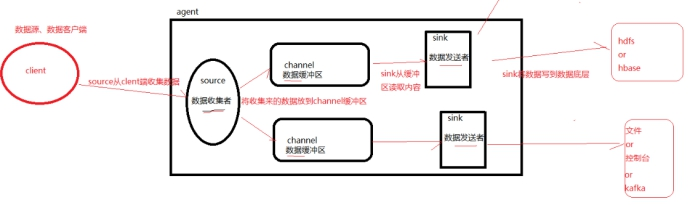

## flume简介
vi flume-env.sh
修改java_home=/home/cq/jdk1.8.0_65  
查看版本：flume-ng version  

client ：生产数据，运行在一个独立的线程  
event ：是flume数据传输的基本单元  
agent：jvm 运行flume的最小独立单元，由source、channel和sink三大组件构成  
source：从client收集数据，传递给channel  
channel：数据缓冲区，连接 source和sink，像一个队列  
memory channel: 基于内存，volatile(挥发)  
file channel: 基于wal(预写式日志write-ahead logging）实现  
jdbc channel: 基于嵌入database实现  
        channel支持事务，提供较弱的顺序保证  
sink：从channel收集数据，运行在一个独立线程，可以存储数据，也可以继续传输。  
注意事项：  
memory-channel：效率高但可能有丢数据的风险，使用memory-channel时，把capacity设置的足够小，使内存中的数据尽可能少，这样在意外重启和断电时丢的数据就很少  
file-channel：在系统崩溃的时候能保证数据的完整性和一致性，安全性高但效率低，并且一般flume是用于数据传输，引入file-channel时，它的角色会向存储转变，这在整个流程中是不合适的，通常sink端是kafka和hdfs这种可用性和扩张性比较好的系统，不用担心数据拥堵问题  
默认的http source没有设置线程池，有性能问题，如果有用到，需要修改代码。  
单sink速度跟不上时，需要多个sink，比如跨机房数据传输网络延迟高单rpc sink吞吐上不去和hdfs sink效率不高情形，可以在一个channel后配多个sink
***
## 常用案例
<font color=blue>**nginx2hdfs.conf**</font>
```
#  agent组件
a1.sources = r1
a1.sinks = k1
a1.channels = c1
#  配置source
a1.sources.r1.type = exec
a1.sources.r1.channels = c1
a1.sources.r1.command = tail -F /opt/nginx/logs/da_qbsite_dig.access.log    # 要监控的日志文件
#  添加拦截器(正则表达式)
a1.sources.r1.interceptors = regex
a1.sources.r1.interceptors.regex.type=REGEX_FILTER
a1.sources.r1.interceptors.regex.regex=^.+uid=.+&uname=.+spuId=.+$
a1.sources.r1.interceptors.regex.excludeEvents=false
#  配置channel
a1.channels.c1.type = memory
a1.channels.c1.capacity = 1000
a1.channels.c1.transactionCapacity = 100
#  配置sink
a1.sinks.k1.type = hdfs
a1.sinks.k1.channel = c1
a1.sinks.k1.hdfs.path = hdfs://nameservice1/user/flume/qbsite-events/%y-%m-%d/%H%M/
a1.sinks.k1.hdfs.filePrefix = events#
a1.sinks.k1.hdfs.useLocalTimeStamp = true
a1.sinks.k1.hdfs.fileType = DataStream
a1.sinks.k1.hdfs.writeFormat =Text
a1.sinks.k1.hdfs.round = true
a1.sinks.k1.hdfs.roundValue = 10
a1.sinks.k1.hdfs.roundUnit = minute
a1.sinks.k1.hdfs.rollInterval = 60
a1.sinks.k1.hdfs.rollSize = 0
a1.sinks.k1.hdfs.rollCount = 0
a1.sinks.k1.hdfs.batchSize = 1
a1.sinks.k1.hdfs.maxOpenFiles = 1000
#  给source和sink绑定channel
a1.sources.r1.channels = c1
a1.sinks.k1.channel = c1

启动命令：bin/flume-ng agent -c conf -f conf/nginx-hdfs.conf -n a1  (存hdfs需要hadoop环境)
后台运行：bin/nohup flume-ng agent -c conf -f conf/nginx-hdfs.conf -n a1 &
# c：flume配置文件目录
# f：自己写的文件目录
# n：agent的名字
# Dflume.root.logger=INFO,console：日志级别info，输出在控制台，有错误会显示，测试
```
***
<font color=blue>**kafka2hdfs.conf**</font>
```
# 命名agent组件
a1.sources = r1
a1.sinks = k1
a1.channels = c1
# 配置source
a1.sources.r1.type = org.apache.flume.source.kafka.KafkaSource
a1.sources.r1.channels = channel1
a1.sources.r1.zookeeperConnect = localhost:2181
a1.sources.r1.topic = test1
a1.sources.r1.groupId = flume
a1.sources.r1.kafka.consumer.auto.offset.reset = earliest
a1.sources.r1.kafka.consumer.timeout.ms = 100
# 配置channel
a1.channels.c1.type = memory
a1.channels.c1.capacity = 1000
a1.channels.c1.transactionCapacity = 100
# 配置sink
a1.sinks.k1.type = hdfs
a1.sinks.k1.channel = c1
a1.sinks.k1.hdfs.path = hdfs://172.16.14.52:8020/user/flume/qbsite-events/%y-%m-%d/%H%M/
a1.sinks.k1.hdfs.filePrefix = events-
a1.sinks.k1.hdfs.round = true
a1.sinks.k1.hdfs.roundValue = 10
a1.sinks.k1.hdfs.roundUnit = minute
a1.sinks.k1.hdfs.rollInterval = 3
a1.sinks.k1.hdfs.rollSize = 20
a1.sinks.k1.hdfs.rollCount = 5
a1.sinks.k1.hdfs.batchSize = 1
a1.sinks.k1.hdfs.useLocalTimeStamp = true
# 生成的文件类型，默认是Sequencefile，可用DataStream，则为普通文本
a1.sinks.k1.hdfs.fileType = DataStream
# 给source和sink绑定channel
a1.sources.r1.channels = c1
a1.sinks.k1.channel = c
```
***
<font color=blue>**nginx2kafka2spark2redis.conf**</font>
```
下载flume整合kafka插件：flumeng-kafka-plugin.jar放入flume/lib目录下
以及启动flume-ng时需要用到的kafka的jar包：zkclient-0.3.jar、kafka_2.10-0.8.2.2.jar、kafka-clients-0.8.2.2.jar、scala-library-2.10.4.jar、metrics-core-2.2.0.jar(数据统计工具)都要拷贝到flume/lib目录下
#  命名agent组件
a1.sources = r1
a1.channels = c1
a1.sinks = k1
#  配置source
a1.sources.r1.type = exec
a1.sources.r1.command = tail -F /opt/nginx/logs/da_wapsite_dig.access.log (通常是nginx日志)
#  添加拦截器
a1.sources.r1.interceptors = regex
a1.sources.r1.interceptors.regex.type=REGEX_FILTER
a1.sources.r1.interceptors.regex.regex=^.+uid=.+&uname=.+spuId=.+$
a1.sources.r1.interceptors.regex.excludeEvents=false
#  配置channel
a1.channels.c1.type = memory
a1.channels.c1.capacity = 1000
a1.channels.c1.transactionCapacity = 100
#  配置sink
a1.sinks.k1.type = org.apache.flume.plugins.KafkaSink
a1.sinks.k1.metadata.broker.list = ubuntu:9092                                              //kafka端口
a1.sinks.k1.partition.key = 0
a1.sinks.k1.partitioner.class = org.apache.flume.plugins.SinglePartition                    //kafka分区
a1.sinks.k1.serializer.class = kafka.serializer.StringEncoder                               //序列化
a1.sinks.k1.request.required.acks = 0                                                       //设置ack
a1.sinks.k1.max.message.size = 1000000                                                      //message最大尺寸
a1.sinks.k1.producer.type = sync                                                            //同步
a1.sinks.k1.custom.encoding = UTF-8                                                        //编码
a1.sinks.k1.custom.topic.name = test                                                        //topic名称
#  给source和sink绑定channel
a1.sources.r1.channels = c1
a1.sinks.k1.channel = c1

1、先启动kafka：
kafka-server-start.sh config/server.properties &
kafka-topics.sh --create --zookeeper ubuntu:2181 --replication-factor 1 --partitions 1 --topic test
kafka-console-consumer.sh --zookeeper ubuntu:2181 --from-beginning --topic test
2、再启动flume-ng：
flume-ng agent -c conf/ -f conf/flume-kafka.conf -n a1 -Dflume.root.logger=INFO,console
3、往监测的文件test.log里边写数据，echo "犯我德邦者  虽远必诛 " >> test.log
制造数据：for i in {1..10000};do echo "hello world $i" >> test.log;echo $i;sleep 0.01;done
kafka的consumer接收到消息说明成功
注意事项：spark要和zookeeper/kafka装在同一套集群环境上，因为spark作为consumer消费kafka的数据后要向zookeeper发送消息，zookeeper会移动offset
```
```java
代码部分：
package org.com.qbao.dc.spark.streaming;
import java.util.ArrayList;
import java.util.HashMap;
import java.util.Iterator;
import java.util.List;
import java.util.regex.Matcher;
import java.util.regex.Pattern;
import org.apache.log4j.Logger;
import org.apache.spark.Accumulator;
import org.apache.spark.SparkConf;
import org.apache.spark.api.java.JavaRDD;
import org.apache.spark.api.java.StorageLevels;
import org.apache.spark.api.java.function.Function;
import org.apache.spark.api.java.function.VoidFunction;
import org.apache.spark.streaming.Durations;
import org.apache.spark.streaming.api.java.JavaDStream;
import org.apache.spark.streaming.api.java.JavaPairReceiverInputDStream;
import org.apache.spark.streaming.api.java.JavaStreamingContext;
import org.apache.spark.streaming.kafka.KafkaUtils;
import org.springframework.beans.factory.annotation.Autowired;
import org.springframework.context.ApplicationContext;
import org.springframework.context.support.ClassPathXmlApplicationContext;
import com.qbao.dc.redis.IRedisService;
import com.qbao.dc.redis.common.RedisModel;
import com.qbao.dc.redis.factory.RedisModelFactory;
import com.qbao.dc.redis.impl.IRedisServiceImpl;
import com.qbao.dc.redis.model.SpuCount;
import com.qbao.dc.redis.model.UserViewCountData;
import redis.clients.jedis.Jedis;
import scala.Tuple2;
public final class KafkaToRedis {
//    private static final Pattern SPACE = Pattern.compile(" ");
    private static Logger logger = Logger.getLogger(KafkaToRedis.class);
    private static IRedisService iRedisService= null;
    private static boolean isInitXml = true;
    @SuppressWarnings({ "deprecation", "serial" })
    public static void main(String[] args) throws InterruptedException {
        //错误提示
        if(args.length < 4){
            System.err.println("Usage: KafkaWordCount <zkQuorum> <group> <topics> <numThreads>");
            System.exit(1);
        }
        //加载配置文件
        SparkConf conf = new SparkConf().setAppName("KafkaToRedis");
        //生成stream context
        JavaStreamingContext jssc = new JavaStreamingContext(conf, Durations.seconds(3));
        //指定topic的线程数
        int numThreads = Integer.parseInt(args[3]);
        //封装topic
        HashMap<String, Integer> topicMap = new HashMap<String, Integer>();
        String[] topics = args[2].split(",");
        for (String topic : topics) {
            topicMap.put(topic, numThreads);
        }
        //获取kafka数据流
        JavaPairReceiverInputDStream<String, String> messages =
                KafkaUtils.createStream(jssc, args[0], args[1], topicMap,StorageLevels.MEMORY_AND_DISK_SER);
        //将messages转换为DStream数据流
        JavaDStream<String> lines = messages.map(new Function<Tuple2<String,String>, String>() {
            public String call(Tuple2<String, String> tuple2) throws Exception {
                return tuple2._2();
            }
        });
        //将JavaDStream类型转换成String类型
        lines.foreach(new Function<JavaRDD<String>, Void>() {
            @Override
            public Void call(JavaRDD<String> rdd) throws Exception {
                //遍历循环每条记录
                rdd.foreachPartition(new VoidFunction<Iterator<String>>() {
                    @Override
                    public void call(Iterator<String> records) throws Exception {
                        if(isInitXml){
                            //加载spring配置文件
                            String paths[] = new String[]{"qbao_dc_redis_application.xml"};
                            ApplicationContext ctx = new ClassPathXmlApplicationContext(paths);
                            //获取iRedisService接口
                            iRedisService = ctx.getBean(IRedisServiceImpl.class);
                            isInitXml = false;
                        }
                        while(records.hasNext()){
                            //拿到一条记录
                            String record = records.next();
                            //添加regex
                            Pattern p1 = Pattern.compile("uid=(\\d+)");
                            Pattern p2 = Pattern.compile("spuId=(\\d+)");
                            //匹配当前记录
                            Matcher m1 = p1.matcher(record);
                            Matcher m2 = p2.matcher(record);
                            //获取字段值
                            if(m1.find() && m2.find()){
                                UserViewCountData data = new UserViewCountData();
                                String uid = m1.group(1);
                                String spuId = m2.group(1);
                                //获取QueryModel
                                RedisModel queryModel = RedisModelFactory.getQueryModel(uid, UserViewCountData.class);
                                //调用find方法
                                RedisModel model=iRedisService.find(queryModel);
                                //如果该uid已经存在
                                if(model.getValue()!=null){
                                    //获取该uid
                                    data = (UserViewCountData) model.getValue();
                                    //获取该uid对应的所有spus
                                    List<SpuCount> list = data.getSpus();
                                    //判断spuId是否存在
                                    boolean isExist = false;
                                    //循环spucount
                                    for(SpuCount spucount : list){
                                        //spuId已存在
                                        if(spucount.getSpuId().equals(spuId)){
                                            //次数直接+1
                                            spucount.setCount(spucount.getCount()+1);
                                            isExist=true;
                                            break;
                                        }
                                    }
                                    //如果spuId不存在
                                    if(!isExist){
                                        SpuCount spucount = new SpuCount();
                                        //添加该spuId
                                        spucount.setSpuId(spuId);
                                        //给个初始值1
                                        spucount.setCount(1);
                                        //将该spuId添加到spus集合中
                                        list.add(spucount);
                                    }
                                //如果该uid不存在
                                }else{
                                    //先添加该uid
                                    data.setUid(uid);
                                    List<SpuCount> list  = new ArrayList<SpuCount> ();
                                    SpuCount spucount = new SpuCount();
                                    //添加该spuId
                                    spucount.setSpuId(spuId);
                                    //给个初始值1
                                    spucount.setCount(1);
                                    //将该spuId添加到spus集合中
                                    list.add(spucount);
                                    //添加到UserViewCountData
                                    data.setSpus(list);
                                }
                              //获取RedisModel
                              RedisModel redisModel=RedisModelFactory.getRedisModel(data.getUid(), data);
                              //保存到redis
                              iRedisService.save(redisModel);
                            }
//                            Jedis jedis = new Jedis("172.16.14.128", 6379);
//
//                                //jedis.set(m1.group(1), m2.group(1));
//                                jedis.set(m1.group(),m2.group());
//                                jedis.close();
//                            }
                        }
                    }
                });
                return null;
            }
        });
//        //切割
//        JavaDStream<String> words = lines.flatMap(new FlatMapFunction<String, String>() {
//
//            public Iterable<String> call(String s) throws Exception {
//                return Arrays.asList(SPACE.split(s));
//            }
//        });
//        //统计次数
//        JavaPairDStream<String, Integer> wordCounts = words.mapToPair(new PairFunction<String, String, Integer>() {
//
//            public Tuple2<String, Integer> call(String s) throws Exception {
//                return new Tuple2<String, Integer>(s, 1);
//            }
//        }).reduceByKey(new Function2<Integer, Integer, Integer>() {
//
//            public Integer call(Integer a, Integer b) throws Exception {
//                return a + b;
//            }
//        });
//        //输出操作
//        wordCounts.foreachRDD(new Function<JavaPairRDD<String,Integer>, Void>() {
//
//            @Override
//            public Void call(JavaPairRDD<String, Integer> rdd) throws Exception {
//                //遍历循环rdd
//                rdd.foreach(new VoidFunction<Tuple2<String,Integer>>() {
//
//                    @Override
//                    public void call(Tuple2<String, Integer> wordcount) throws Exception {
//                        //看是否打印结果
//                        System.out.println(wordcount._1() + ":" + wordcount._2());
//                        //将wordcount以(k,v)键值对形式存入redis
//                        Jedis jedis = new Jedis("172.16.14.128", 6379);
//                        jedis.select(0);
//                        jedis.set(wordcount._1(), wordcount._2().toString());
//                    }
//                });
//                return null;
//            }
//        });
        //启动程序
        jssc.start();
        jssc.awaitTermination();
    }

```

