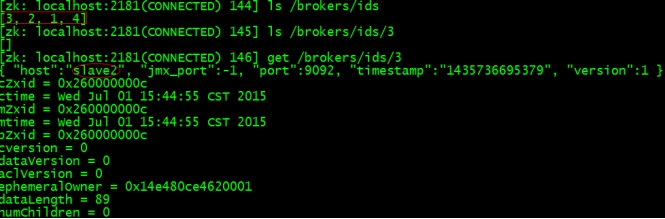
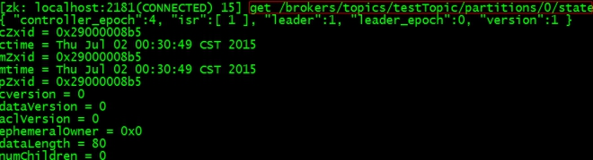
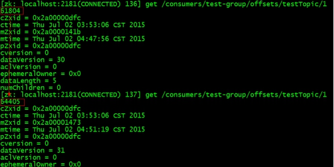

### kafka
```bash
# Kafka是基于发布-订阅模式的分布式消息队列,主要应用于大数据实时处理领域
# 消息队列作用：异步(注册发短信)、消峰(秒杀系统流量消峰)、解耦
[root@master1 ~]# vim server.properties
# broker的全局唯一编号,不能重复
broker.id=0
# 开启删除topic功能
delete.topic.enable=true
# 处理网络请求的线程数
num.network.threads=3
# 处理磁盘io的线程数
num.io.threads=8
# 发送套接字的缓冲区大小
socket.send.buffer.bytes=102400
# 接收套接字的缓冲区大小
socket.receive.buffer.bytes=102400
# 请求套接字的缓冲区大小
socket.request.max.bytes=104857600
# kafka运行日志存放路径
log.dirs=/opt/module/kafka/logs
# topic在当前broker上的分区个数
num.partitions=1
# 恢复和清理data下数据的线程数
num.recovery.threads.per.data.dir=1
# segment文件保留的最长时间,超时将被删除
log.retention.hours=168
# 配置Zookeeper地址
zookeeper.connect=cdh1:2181,cdh2:2181,cdh3:2181

[root@master1 ~]# vim /etc/profile && source /etc/profile
export KAFKA_HOME=/opt/module/kafka
export PATH=$PATH:$KAFKA_HOME/bin

# 分发到其他节点
scp -r kafka cdh2:/opt/module/kafka && broker.id=2
scp -r kafka cdh3:/opt/module/kafka && broker.id=3

# 先启动zookeeper  
[root@master1 ~]# zkServer.sh start  
# 在每个节点启动broker  
[root@master1 ~]# kafka-server-start.sh config/server.properties &
 
5、在kafka集群中创建topic  
kafka-topics.sh --create --zookeeper centos01:2181 --replication-factor 3 --partitions 1 --topic girls  
kafka-topics.sh --create --zookeeper centos01:2181 --replication-factor 3 --partitions 1 --topic boys  
查看有几个topic：  kafka-topics.sh --list --zookeeper centos01:2181  
查看topic分区和副本信息：kafka-topics.sh --describe --zookeeper  centos01:2181  
删除topic：kafka-topics.sh --delete --zookeeper ubuntu:2181 --topic test01  
（注意：要先在server.properties最后一行添加配置delete.topic.enable=true，不然删不掉）  
    
6、用一个producer向某一个topic中写入消息  
kafka-console-producer.sh --broker-list centos01:9092 --topic replicationgirls  
i love xiaohuli   
she is my baby  
i want to do everything with her  
7、用一个comsumer从某一个topic中读取信息  
kafka-console-consumer.sh --zookeeper centos01:2181 --from-beginning --topic replicationgirls  
Kafka优点：  
1、 集群模式，易于扩展  
2、 依赖zookeeper保存meta信息和维护集群，稳定性好  
3、 消息采用consumer直接pull的方式，集群压力小  
4、 集群基于消息做主备，而不是服务器，稳定性高  
kafka组件  
消息收发原理：  
1、Producer将消息发送到指定topic的partition（在new KeyedMessage时指定partition）默认走轮询  
2、kafka集群接收消息后，将其持久化到硬盘，并保留消息指定时长，而不关注消息是否被消费  
3、Consumer从kafka集群pull数据，正常消费信息时offset会"线性"向前驱动,即消息将按照顺序被消费  
Topic ：消息根据topic进行归类，每个topic被分成多个partition(区)  
partition：在存储层面是逻辑append log文件，包含多个segment文件  
Segement：消息存储的真实文件，会不断追加生成新的消息，默认存储7天  
offset：消息在文件中的位置（偏移量）  
```
  
  
### kafka api
```java
public class ProducerDemo {  
    public static void main(String[] args) throws Exception {  
        //新建属性  
        Properties prop = new Properties();  
        //添加连接的zookeeper  
        prop.put("zookeeper.connect", "centos01:2181,centos02:2181,centos03:2181");  
        //添加kafka服务器列表  
        prop.put("metadata.broker.list", "centos01:9092,centos02:9092,centos03:9092");  
        //添加数据的序列化类  
        prop.put("serializer.class", "kafka.serializer.StringEncoder");  
        //新建producer配置信息  
        ProducerConfig config = new ProducerConfig(prop);  
        //创建producer  
        Producer<String,String> producer = new Producer<String,String>(config);  
        //生产消息  
        for (int i = 0; i < 100; i++) {  
            //设置线程休眠时间（不然会一直不停的发）  
            Thread.sleep(100);  
            //发送消息  
            producer.send(new KeyedMessage<String,String>("replicationgirls", "hehe"+i));  
        }  
    }  
}  

public class ConsumerDemo {  
    public static void main(String[] args) {  
        //新建属性  
        Properties prop = new Properties();  
        //添加zookeeper连接  
        prop.put("zookeeper.connect", "centos01:2181,centos02:2181,centos03:2181");  
        //添加group  
        prop.put("group.id", "001");  
        //添加offset（kafka支持从指定偏移量读取消息）  
        prop.put("auto.offset.reset", "smallest");  
        //新建consumer配置信息  
        ConsumerConfig config = new ConsumerConfig(prop);  
        //API编写入口  
        ConsumerConnector consumer = Consumer.createJavaConsumerConnector(config);  
        //用map集合封装多个topic：String表示topic名称，Integer表示线程数  
        HashMap<String,Integer> map = new HashMap<String,Integer>();  
        map.put("replicationgirls", 3);  
        map.put("replicationboys", 2);  
        map.put("replicationstudents", 1);  
        //创建消息流：String表示topic名称，List有多个线程在跑这个消息流  
        Map<String,List<KafkaStream<byte[],byte[]>>> MessageStreams = consumer.createMessageStreams(map);
        //获取指定topic的streams：两个byte[]分别表示消息体和消息内容  
        List<KafkaStream<byte[], byte[]>> streams = MessageStreams.get("replicationgirls");  
        //遍历循环streams，有几个kafkaStream就new几个线程  
        for (final KafkaStream<byte[], byte[]> kafkaStream : streams) {  
            new Thread(new Runnable() {  
                @Override  
                public void run() {  
                    //遍历每个kafkaStream，获取message和metadata  
                    for (MessageAndMetadata<byte[], byte[]> mm : kafkaStream) {  
                        //获取message  
                        String msg = new String(mm.message());  
                        //接下来是数据处理的业务逻辑  
                        System.out.println(msg);  
                    }  
                }  
            }).start();  
        }  
    }  
}  
```
### zookeeper监控
kafka启动时会在zookeeper上创建brokers节点和consumers节点。  
    
ids：监控broker是否存活     格式: /brokers/ids/[0...N]    
  
topics：查找partition在哪台broker上     格式: /brokers/topics/[topic]/partitions/[0...N]   
  
  
owners：标记partition被组内哪个consumer消费.临时znode。  
格式: /consumers/[group_id]/owners/[topic]/[broker_id-partition_id]  
    
    
ids：记录该组中的consumer消费的topic的partition个数  
格式: /consumers/[group_id]/ids/[consumer_id]  
  
offsets：跟踪每个consumer组目前所消费的partition中最大的offset。    
格式: /consumers/[group_id]/offsets/[topic]/[broker_id-partition_id]  
  
