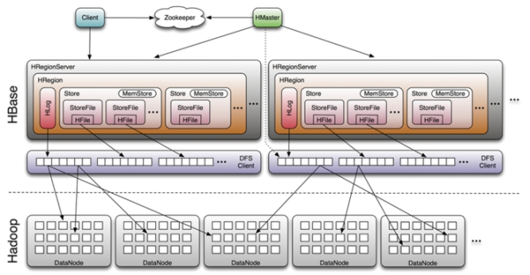

## hbase入门
[hbase习题](http://blog.csdn.net/lifuxiangcaohui/article/details/39961643)
一个或者多个主节点,Hmaster (没有单点问题,可以启动多个)  
多个从节点,HregionServer  
hbase依赖hadoop和zookeeper  
所以先启hadoop和zookeeper,再启hbase；先关hbase,再关hadoop和zookeeper  
整体启动：start-hbase.sh  
单点启动：hbase-daemon.sh start master  
client：请求数据  
hmaster：管理者  
hregionserver：和hdfs做交互,读写数据  
zookeeper：协调者,注册节点,监控节点  
1.数据类型：HBase只有简单的字符类型,所有的类型都是交由用户自己处理,它只保存字符串  
            RDBMS有丰富的类型和存储方式  
2.数据操作：HBase只有简单的插入、查询、删除、清空等操作,表和表之间是分离的  
            RDBMS通常有各式各样的函数和连接操作  
3.存储模式：HBase是基于列存储的,每个列族都由几个文件保存,不同列族的文件是分离的  
            RDBMS是基于表格结构和行模式保存的  
4.数据维护：HBase的不支持更新操作,它实际上是插入了新的数据  
            RDBMS是替换修改  
5.可伸缩性：Hbase能够轻松增加或减少硬件的数 量,并且容错性很好  
                    RDBMS通常需要增加中间层才能实现类似的功能  
hbase应用场景  
1、半结构化、非结构化数据  
结构化数据：一行数据表示一个实体信息,每一行数据属性相同；数字、符号等  
半结构化数据：属于同一类实体但可以有不同属性且属性顺序无所谓；xml、json  
非结构化数据：没有固定结构的数据；文本、图片、音频/视频等,字段长度可变  
对于数据结构字段不确定或杂乱无章很难按一个概念去进行抽取的数据适合用HBase。以上面的例子为例,当业务发展需要存储author的email,phone,address信息时RDBMS需要停机维护,而HBase支持动态增加  
2、有很多null值  
RDBMS每一行有多少列是固定的,很多值为null的列的存在会浪费存储空间  
HBase为值null的Column不会被存储,这样既节省了空间又提高了读的性能  
3、多版本数据  
Hbase根据Row key和Column key定位到的Value可以有任意数量的版本值,方便对比历史记录  
4、超大数据量  
如果数据量越来越大,RDBMS撑不住了,就要采取读写分离策略,甚至要分库分表,导致join操作不能用；HBase是面向列存储,可以动态增加列,并且自动水平切分扩展,跟Hadoop的集成可以保证数据可靠性(HDFS)及分析海量数据的高性能(MapReduce)  
htable基本概念  
Row key(行主健)：需要根据业务进行设计以利用其存储排序特性提高性能  
Column Family(列族)：创建表时声明,每个CF为一个存储单元,包含多个Column,并且按照Column key   排序,  
                                         因此设计时可以将具有相同I/O特性的Column放进同一个CF提高性能  
Column(列)：每个列都属于一个列族,以列族名为前缀,列article:title和article:content属于article列族  
Timestamp(时间戳)：HBase通过row和column确定一份数据,这份数据的值可能有多个version,按照时 间倒序排  
                                      序,查询时默认返回最新版本  
Value：每个值通过4个键唯一确定,tableName+RowKey+ColumnKey+Timestamp=>value  
存储类型  
TableName ：字符串  
RowKey 和 ColumnName ：二进制值(Java 类型 byte[])  
Timestamp ：是一个64 位整数(Java 类型 long)  
value ：是一个字节数组(Java类型 byte[])  
存储结构  
    
hbase和hive区别  
两者都是架构在hadoop之上的,以hdfs作为底层存储  
Hive：高延迟、结构化、面向分析  
Hbase：低延迟、非结构化、面向编程  
类似于操作RDBMS数据库：  hive--->全表扫描        hbase--->索引访问  
关于表：hive表是逻辑表,本身不存储和计算数据,完全依赖于Hdfs和MapReduce  
             hbase表是物理表,提供一个超大的内存hash表,可以存储索引,方便查询操作  
<font color=red>LSM树</font>    
3种基本存储引擎：  
哈希存储：支持增、删、改、查,但不支持顺序扫描,对应存储系统为key-value  
B树存储：支持增、删、改、查操作,还支持顺序扫描,对应存储系统为关系型数据库(Mysql等)  
LSM树存储：支持增、删、改、查、顺序扫描操作；<font color=blue>并且通过批量存储技术避免了磁盘随机写入问题与B树相比,LSM树牺牲了部分读性能(不能指定条件查询),而大幅提高了写性能</font>    
LSM树设计思想：将对数据的修改增量保持在内存中,达到大小限制后将这些修改操作批量写入磁盘  
LSM树原理：把一棵大树拆分成n棵小树,它首先将小树写入内存中,随着小树越来越大,内存中的小树会 flush到磁盘  
                     中,磁盘中的树定期会做merge操作,合并成一棵大树,优化读性能  
Hbase存储：为了防止内存数据丢失,小树写进内存的同时会暂时持久化到磁盘,分别对应HBase的MemStore    和HLog,MemStore上的树达到一定大小之后,会flush到HRegion磁盘中(一般就是Hadoop    DataNode)这样MemStore就变成了DataNode上的磁盘文件StoreFile,然后HRegionServer定期会对DataNode数据做merge操作,彻底删除无效空间,多棵小树此时合并成大树,来增强读性能  
WAL机制：每个HRegionServer中都会有一个HLog对象,HLog是一个实现Write Ahead Log的类,每次用户操作写入Memstore的同时,也会写一份数据到HLog文件,HLog文件定期会滚动刷新,并删除旧文件(已经持久化到StoreFile中的数据)  
数据恢复：如果HRegionServer故障,HMaster会通过Zookeeper感知,HMaster首先处理遗留的HLog文件,将不同region的log数据拆分,分别放到相应region目录下,然后再将失效的region重新分配,领取到这些region的HRegionServer在Load Region的过程中,会发现有历史遗留HLog需要处理,因此会Replay HLog中的数据到MemStore中,然后flush到StoreFiles,完成数据恢复  
  
Hbase数据导入  
方式一：通过client api逐条put,慢  
方式二：用sqoop(待研究)  
方式三：hive关联hbase批量插入数据  
将hive/lib下的hive-hbase-handler-0.13.1.jar复制到hbase/lib下  
先把hive-site.xml里面那个HIVE_AUX_JARS_PATH去掉  
然后修改hive-env.sh  
export HIVE_AUX_JARS_PATH=/home/cq/hbase-0.96.2-hadoop2/lib  
创建hbase表：  
hbase> create 'hbase_student', 'info'  
创建与hbase表关联的hive表：  
CREATE EXTERNAL TABLE hive_student (rowkey string, name string, age int, phone string)  
STORED BY 'org.apache.hadoop.hive.hbase.HBaseStorageHandler'  
WITH SERDEPROPERTIES  
("hbase.columns.mapping" = ":key,info:name,info:age,info:phone")  
TBLPROPERTIES("hbase.table.name" = "hbase_student");  
创建hive临时表：  
CREATE EXTERNAL TABLE data_student (rowkey string, name string, age int, phone string)  
ROW FORMAT DELIMITED FIELDS TERMINATED BY '\t'    
LOCATION '/test/data_student';  
往临时表里load数据：  
load data local inpath '/home/cq/test.data' into table data_student;  
通过临时表向hive表插入数据(此时hbase表也有数据了)  
SET hive.hbase.bulk=true;  
INSERT OVERWRITE TABLE hive_student SELECT rowkey, name, age, phone FROM data_student;  
hbase安装  
在centos01上安装Hbase  
注意：要把hadoop的hdfs-site.xml和core-site.xml 放到hbase/conf下  
```
修改hbase-env.sh  
export JAVA_HOME=/home/cq/jdk1.8.0_65  
//告诉hbase不使用自己的zk,用外部的(在122行)  
export HBASE_MANAGES_ZK=false  
修改hbase-site.xml  
<configuration>  
<!-- 指定hbase在HDFS上存储的路径 -->  
<property>  
<name>hbase.rootdir</name>  
<value>hdfs://ns1/hbase</value>  
</property>  
<!-- 指定hbase是分布式的 -->  
<property>  
<name>hbase.cluster.distributed</name>  
<value>true</value>  
</property>  
<!-- 指定zk地址,多个用“,”分割 -->  
   <property>  
   <name>hbase.zookeeper.quorum</name>  
   <value>centos01:2181,centos02:2181,centos03:2181</value>  
   </property>  
</configuration>  
```
修改regionservers  
centos01  
centos02  
centos03  
拷贝hbase到其他节点：scp -r hbase-0.96.2-hadoop2/ centos02:/home/cq  
启动hbase集群(hbase依赖hdfs和zk,hbase后启先关)  
先启动zk： zkServer.sh start  
再启动hadoop： start-dfs.sh  
然后启动hbase： start-hbase.sh  
页面监控： centos01:60010  
<font color=red>hbase shell</font>   
进入：hbase shell    退出：quit  
list  
创建表：(VERSION表示保存数据的版本,默认1,只显示最新版本的数据,可修改)  
create 'user_info',{NAME => 'base_info',VERSION => 3},{NAME => 'extra_info'}  
添加数据：  
put 'user_info','user0000','base_info:name','duanjinfeng'  
put 'user_info','user0000','base_info:age','18'  
put 'user_info','user0000','extra_info:love','cq'  
查询数据：  
get 'user_info','user0000'   (字段按字典顺序排序)  
COLUMN                          CELL                                                                                       
 base_info:age                  timestamp=1439956708337, value=18                                                          
 base_info:name                 timestamp=1439956651553, value=duanjinfeng                                                 
 base_info:size                 timestamp=1439956740589, value=34b                                                         
 extra_info:love                timestamp=1439956773454, value=cq  
修改数据：  
put 'user_info','user0000','base_info:name','feng'  (其实并没有修改,而是追加写入,历史数据还在)  
查看历史版本数据：  
get 'user_info','user0000',{COLUMN => 'base_info:name',VERSION =>10  
名称 命令表达式
查看当前用户 whoami  
查看权限 user_permission <table>  
分配权限 `grant <user> <permissions> <table> <column family> <column qualifier>` 参数用逗号分隔权限用五个字母表示："RWXCA"=>READ('R'), WRITE('W'), EXEC('X'), CREATE('C'), ADMIN('A')举例：grant 'test','rw','t1' 给test用户分配对t1表的读写权限
收回权限 `revoke <user> <table> <column family> <column qualifier>`
创建表 create '表名', '列族名1','列族名2','列族名N'  
查看所有表 list  
查看服务器状态 status  
查看hbase版本信息 version  
描述表 describe '表名'  
禁用表 disable '表名' 再次启用表 enable '表名'  
<font color=blue>修改表结构 先disable表,再用alter命令</font>  
判断表存在 exists '表名'  
判断是否禁用启用表 is_enabled '表名' is_disabled '表名'  
添加记录 put '表名', 'rowKey', '列族 : 列' , '值'  
指定rowkey查询 get '表名' , 'rowKey'  
查看总记录数 count '表名' (数据量大时会很慢,不建议使用)  
获取某个列族 get '表名','rowkey','列族'  
获取某个列族的某个列 get '表名','rowkey','列族：列'  
删除记录 delete '表名' ,'rowkey' , '列族：列'  
删除整行 deleteall '表名','rowkey'  
<font color=blue>删除表 第一步 disable '表名'(禁用表) ,第二步 drop '表名'(删除表)</font>    
清空表(删除所有数据) truncate '表名'  
全表扫描 scan "表名" (数据量大时很慢,不建议)  
<font color=red>hbase api</font>    
HTablePool  
包名：org.apache.hadoop.hbase.client.HTablePool  
作用：可以解决HTable存在的线程不安全问题,同时通过维护固定数量的HTable对象,能够在程序运行期间复用这些HTable资源对象  
说明：  
1. HTablePool可以自动创建HTable对象,避免多线程间数据并发修改问题。  
2. HTablePool中的HTable对象之间是公用Configuration连接的,可以减少网络开销。  
HTablePool使用：每次进行操作前,通过HTablePool的getTable方法取得一个HTable对象,然后进行put/get/scan/delete等操作,最后通过HTablePool的putTable方法将HTable对象放回到HTablePool中。  
先导入hbase/lib下的jar包  
```
public class HbaseDemo {  
    static Configuration conf = null;  
    //写一个静态代码块  
    static{  
        //配置文件信息  
        conf = HBaseConfiguration.create();  
        conf.set("hbase.zookeeper.quorum", "Linux-05,Linux-06,Linux-07");  
        conf.set("hbase.zookeeper.property.clientPort", "2181");  
    }  
    //创建表  
    public static void main(String[] args) throws Exception {  
        //表管理读取配置文件  
        HBaseAdmin hBaseAdmin = new HBaseAdmin(conf);  
        //表名  
        TableName tableName = TableName.valueOf("test01");  
        //描述表  
        HTableDescriptor desc = new HTableDescriptor(tableName);  
        //列族  
        HColumnDescriptor f1 = new HColumnDescriptor("f1");  
        f1.setMaxVersions(3);  
        HColumnDescriptor f2 = new HColumnDescriptor("f2");  
        //将列族添加到表的描述中  
        desc.addFamily(f1);  
        desc.addFamily(f2);  
        //根据desc创建表  
        hBaseAdmin.createTable(desc);  
        //关闭表管理  
        hBaseAdmin.close();  
    }  
    //删除表  
    public void testDrop() throws Exception{  
        HBaseAdmin hBaseAdmin = new HBaseAdmin(conf);  
        hBaseAdmin.disableTable("test01");  
        hBaseAdmin.deleteTable("test01");  
        hBaseAdmin.close();  
    }  
    //插入数据（批量插入）  
    @Test  
    public void testInsert() throws Exception{  
        //指定表  
        HTable table = new HTable(conf, "test01");  
        //添加数据  
        Put put = new Put("zhangsan_yule_2015-08-19_hupu".getBytes());  
        put.add("f1".getBytes(), "title".getBytes(), "Jameskoulan".getBytes());  
        put.add("f1".getBytes(), "author".getBytes(), "yuzong".getBytes());  
        put.add("f1".getBytes(), "content".getBytes(), "hdofsdsboahdaha".getBytes());  
        Put put2 = new Put("zhangsan_tiyu_2015-08-19_hupu".getBytes());  
        put2.add("f1".getBytes(), "title".getBytes(), "Jameskoulan".getBytes());  
        put2.add("f1".getBytes(), "author".getBytes(), "yuzong".getBytes());  
        put2.add("f1".getBytes(), "content".getBytes(), "hdofsdsboahdaha".getBytes());  
        ArrayList<Put> list = new ArrayList<Put>();  
        list.add(put);  
        list.add(put2);  
        table.put(list);  
        table.close();  
    }  
//删除数据  
@Test  
    public void testDelete() throws Exception{  
        HTable table = new HTable(conf, "test01");  
        Delete del = new Delete("zhangsan_yule_2015-08-19_hupu".getBytes());  
        table.delete(del);  
        table.close();  
    }  
    //get查询  
    @Test  
    public void testQuery() throws Exception{  
        //指定表  
        HTable table = new HTable(conf, "test");  
        //指定rowkey  
        Get get = new Get(Bytes.toBytes("zhangsan_yule_2015-08-19_hupu"));  
        //添加列族  
        get.addFamily("f1".getBytes());  
        //返回查询结果  
        Result result = table.get(get);  
        byte[] title = result.getValue("f1".getBytes(), "title".getBytes());  
        byte[] author = result.getValue("f1".getBytes(), "author".getBytes());  
        byte[] content = result.getValue("f1".getBytes(), "content".getBytes());  
        System.out.println(new String(title)+" "+new String(author)+" "+new String(content));  
        table.close();  
}  
//scan扫描  
@Test  
public void testScan() throws Exception{  
    HTable table = new HTable(conf,"test");  
    Scan scan = new Scan();  
    ResultScanner scanner = table.getScanner(scan);  
    for (Result res : scanner){  
        for (Cell cell : res.rawCells()){  
            System.out.println("KV: " + cell + ",value: " +   Bytes.toString(CellUtil.cloneValue(cell)));  
        }  
        System.out.println("-------------------------------------");  
    }  
    scanner.close();  
    table.close();  
}  
//过滤器使用  
@Test  
public void testFilter() throws Exception{  
    HTable table = new HTable(conf,"test");  
    Scan scan = new Scan();  
    PrefixFilter pf = new PrefixFilter("row".getBytes());  
    SingleColumnValueFilter scvf = new SingleColumnValueFilter("f1".getBytes(),"author".getBytes(), CompareFilter.CompareOp.EQUAL,new SubstringComparator("ti"));  
    /*List<Filter> filters = new ArrayList<Filter>();  
    filters.add(pf);  
    filters.add(scvf);  
    //FilterList f1 = new FilterList(FilterList.Operator.MUST_PASS_ALL,filters);*/  
    scan.setFilter(pf);  
    scan.setFilter(scvf);  
    ResultScanner scanner = table.getScanner(scan);  
    for (Result res : scanner){  
        for (Cell cell : res.rawCells()){  
            System.out.println("KV: " + cell + ",value: " +    Bytes.toString(CellUtil.cloneValue(cell)));  
        }  
        System.out.println("-------------------------------------");  
    }  
    scanner.close();  
    table.close();  
}       
```
<font color=red>hbase高级特性</font>               
过滤器  
主要有3种：比较过滤器  
专用过滤器  
附加过滤器（要结合其它过滤器使用）  
1、RowFilter：使用BinaryComparator可以筛选出指定行键的行  
              使用CompareFilter.CompareOp.EQUAL可以筛选出符合某一条件的多条数据  
Filter rf = new RowFilter(CompareFilter.CompareOp.EQUAL, new BinaryComparator(                                                                     "row1".getBytes()));   
2、PrefixFilter（针对rowkey）  
   PrefixFilter pf = new PrefixFilter("zh".getBytes());  
3、KeyOnlyFilter：只返回每行的行键,不返回值,可以减少传递到客户端的数据量,起到一定优化作用  
   Filter kof = new KeyOnlyFilter();   
4、RandomRowFilter：按照一定几率（<=0过滤所有行,>=1包含所有行）返回随机结果集,对于需要随机抽 取一部分数据的应用场景,可以使用此过滤器  
Filter rrf = new RandomRowFilter((float) 0.8);     
5、InclusiveStopFilter：扫描时,可以设置开始行键和终止行键,行键默认返回前闭后开区间,即包含起始 行但不包含终止行,可以设置包含终止行  
Filter isf = new InclusiveStopFilter(Bytes.toBytes("row1"));   
6、FirstKeyOnlyFilter：只返回结果集中包含第一列的数据,它在找到每行的第一列之后就会停止扫描,从    而提升扫描性能  
Filter fkof = new FirstKeyOnlyFilter();     
7、ColumnPrefixFilter：按照列名前缀来筛选单元格  
Filter cpf = new ColumnPrefixFilter(Bytes.toBytes("qual1"));    
8、ValueFilter：按照具体的值来筛选单元格  
Filter vf = new ValueFilter(CompareFilter.CompareOp.EQUAL, new SubstringComparator("R OW2_QUAL1"));    
9、ColumnCountGetFilter：限定每行最多能返回多少列,在遇到某行的列数超过设定值的时候,结束扫描  
Filter ccf = new ColumnCountGetFilter(2);     
10、SingleColumnValueFilter：返回结果集中包含指定的某一列的值的数据 SingleColumnValueFilter scvf = new SingleColumnValueFilter(           
Bytes.toBytes("f1"),  
Bytes.toBytes("author"),  
CompareFilter.CompareOp.NOT_EQUAL,  
new SubstringComparator("li"))  
scvf.setFilterIfMissing(false); //默认值false：如果这个列本身就不存在,就不设置该filter  
scvf.setLatestVersionOnly(true);   
11、SingleColumnValueExcludeFilter：作为筛选条件的列不会包含在返回的结果中  
12、SkipFilter：附加过滤器,与ValueFilter结合使用,发现某行中的某列不符合条件,整行就会被过滤掉  
Filter skf = new SkipFilter(vf);   
13、WhileMatchFilter：返回在遇到某种条件数据之前的数据,遇到不符合设定条件的数据时,扫描自动结束  
Filter wmf = new WhileMatchFilter(rf);     
14、FilterList：综合使用多个过滤器。  
两种关系：FilterList.Operator.MUST_PASS_ONE和FilterList.Operator.MUST_PASS_ALL（默认）,分 别是OR和AND的关系,并且FilterList可以嵌套使用FilterList,以表达更多的需求：  
List<Filter> filters = new ArrayList<Filter>();    
filters.add(rf);    
filters.add(vf);    
FilterList fl = new FilterList(FilterList.Operator.MUST_PASS_ALL, filters);    
快照  
HBase备份：复制并导出表或者在关闭表之后拷贝HDFS中所有HFile,复制导出是通过调用MapReduce程序  
扫描并复制表,对RegionServer有影响,关闭表则会停止所有读写操作  
HBase快照：允许不拷贝数据,直接克隆一张表,对RegionServer影响很小,导出快照是在HDFS层面操作, 与HMaster和RegionServer无关,因此不需要为数据创建缓存空间,也不会有扫描过程  
1、给表建立快照：  
hbase> snapshot 'test', 'test_snapshot'  
2、列出存在的快照：  
hbase> list_snapshots  
3、删除快照：  
hbase> delete_snapshot 'test_snapshot'  
4、基于快照复制生成新表：  
hbase> clone_snapshot 'test_snapshot', 'newtest'  
5、基于快照恢复数据：  
hbase> disable 'test'  
hbase> restore_snapshot 'test_snapshot'  
hbase> enable 'test'  
6、将快照导出到另一个集群：  
采用16个mappers来把一个名为MySnapshot的快照复制到一个名为srv2的集群当中  
hbase class org.apache.hadoop.hbase.snapshot.ExportSnapshot -snapshot MySnapshot -copy-to hdfs://srv2:8020/hbase -mappers 16  
Ganglia监控hadoop、hbase集群  
<font color=red>hbase 性能优化</font>  
修改Linux最大文件数  
Linux默认最大可打开文件数是1024,并发量大时会出现“Too Many Open Files”错误,导致hbase挂掉  
查看： ulimit -a    结果：open files  (-n) 1024  
临时修改： ulimit -n 4096  
持久修改：  
vi /etc/security/limits.conf在文件最后加上：  
* soft nofile 65535  
* hard nofile 65535  
* soft nproc 65535  
* hard nproc 65535  
修改 JVM 配置  
修改hbase-env.sh文件中的配置参数  
—HBASE_HEAPSIZE 4000 #HBase使用的 JVM 堆的大小  
—HBASE_OPTS "‐server ‐XX:+UseConcMarkSweepGC"JVM #GC选项  
参数解释：  
-client,-server  
这两个参数用于设置虚拟机使用何种运行模式,  
client模式启动快,但运行性能和内存管理效率不如server模式,通常用于客户端应用程序。  
server模式启动慢,但运行性能高。  
‐XX:+UseConcMarkSweepGC：设置为并发收集  
修改hbase-site.xml  
zookeeper.session.timeout  
—默认值：3分钟（180000ms）,可以改成1分钟  
说明：RegionServer与Zookeeper间的连接超时时间。当超时时间到后,ReigonServer会被Zookeeper从RS集群清单中移除,HMaster收到移除通知后,会对这台server负责的regions重新balance,让其他存活的RegionServer接管.  
调优：  
这个timeout决定了RegionServer是否能够及时的failover。设置成1分钟或更低,可以减少因等待超时而被延长的failover时间。  
不过需要注意的是,对于一些Online应用,RegionServer从宕机到恢复时间本身就很短的（网络闪断,crash等故障,运维可快速介入）,如果调低timeout时间,反而会得不偿失。因为当ReigonServer被正式从RS集群中移除时,HMaster就开始做balance了（让其他RS根据故障机器记录的WAL日志进行恢复）。当故障的RS在人工介入恢复后,这个balance动作是毫无意义的,反而会使负载不均匀,给RS带来更多负担。特别是那些固定分配regions的场景。   
hbase.regionserver.handler.count   
默认值：10  
说明：RegionServer的请求处理IO线程数。  
调优：  
这个参数的调优与内存息息相关。  
较少的IO线程,适用于处理单次请求内存消耗较高的Big PUT场景（大容量单次PUT或设置了较大cache的scan,均属于Big PUT）或ReigonServer的内存比较紧张的场景。  
较多的IO线程,适用于单次请求内存消耗低,TPS（吞吐量）要求非常高的场景。  
hbase.hregion.max.filesize   
默认值：256M  
说明：在当前ReigonServer上单个Reigon的最大存储空间,单个Region超过该值时,这个Region会被自动split成更小的region。  
调优：  
小region对split和compaction友好,因为拆分region或compact小region里的storefile速度很快,内存占用低。缺点是split和compaction会很频繁。  
特别是数量较多的小region不停地split, compaction,会导致集群响应时间波动很大,region数量太多不仅给管理上带来麻烦,甚至会引发一些Hbase的bug。  
一般512以下的都算小region。  
大region,则不太适合经常split和compaction,因为做一次compact和split会产生较长时间的停顿,对应用的读写性能冲击非常大。  
hfile.block.cache.size    
默认值：0.2  
说明：storefile的读缓存占用内存的大小百分比,0.2表示20%。该值直接影响数据读的性能。  
调优：当然是越大越好,如果写比读少很多,开到0.4-0.5也没问题。如果读写较均衡,0.3左右。如果写比读多,果断默认吧。  
—HBase上Regionserver的内存分为两个部分,一部分作为Memstore,主要用来写；另外一部分作为BlockCache,主要用于读。  
—写请求会先写入Memstore,Regionserver会给每个region提供一个Memstore,当Memstore满64MB以后,会启动 flush刷新到磁盘。  
—读请求先到Memstore中查数据,查不到就到BlockCache中查,再查不到就会到磁盘上读,并把读的结果放入BlockCache。由于BlockCache采用的是LRU策略,因此BlockCache达到上限(heapsize * hfile.block.cache.size * 0.85)后,会启动淘汰机制,淘汰掉最老的一批数据。  
—一个Regionserver上有一个BlockCache和N个Memstore,它们的大小之和不能大于等于内存 * 0.8,否则HBase不能启动。默认BlockCache为0.2,而Memstore为0.4。对于注重读响应时间的系统,可以将 BlockCache设大些,比如设置BlockCache=0.4,Memstore=0.39,以加大缓存的命中率。  
hbase.hregion.memstore.block.multiplier    
默认值：2  
说明：当一个region里的memstore占用内存大小超过hbase.hregion.memstore.flush.size两倍的大小时,block该region的所有请求,进行flush,释放内存。  
虽然我们设置了region所占用的memstores总内存大小,比如64M,但想象一下,在最后63.9M的时候,我Put了一个200M的数据,此时memstore的大小会瞬间暴涨到超过预期的hbase.hregion.memstore.flush.size的几倍。这个参数的作用是当memstore的大小增至超过hbase.hregion.memstore.flush.size 2倍时,block所有请求,遏制风险进一步扩大。  
调优： 这个参数的默认值还是比较靠谱的。如果你预估你的正常应用场景（不包括异常）不会出现突发写或写的量可控,那么保持默认值即可。  
<font color=red>hbase客户端优化</font>    
1、取消自动flush：将HTable的setAutoFlush设为false,支持客户端批量更新,即Put填满客户端flush缓存   时才会发送到服务端  
2、添加扫描缓存：scanner一次缓存多条数据来scan（从服务端一次抓取多条数据）默认值是1  
3、指定列簇扫描：scan时指定需要的Column Family,减少通信量  
4、关闭扫描器：通过scan取完数据后,记得要关闭ResultScanner  
5、使用过滤器：当返回结果只需要row key时,在scan中添加filterList,并设置 MUST_PASS_ALL  
6、关闭 WAL 机制：当Put非重要数据时,可以设置writeToWAL(false),会在Put时放弃写WAL log,进一 步提高写性能,但是有风险,如果RegionServer宕机,刚才Put的数据会丢失,且无法恢复  
7、启用Bloom Filter：Bloom Filter通过空间换时间,提高读操作性能  
  
