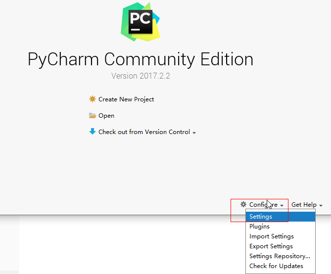
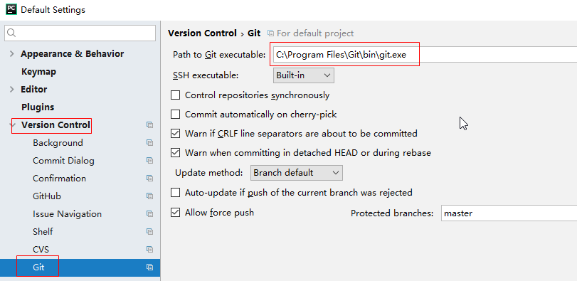
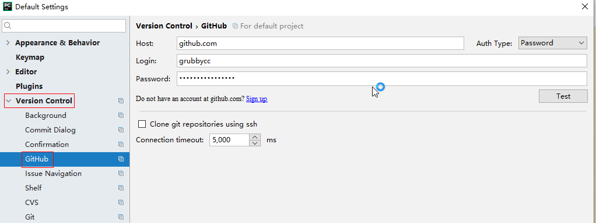
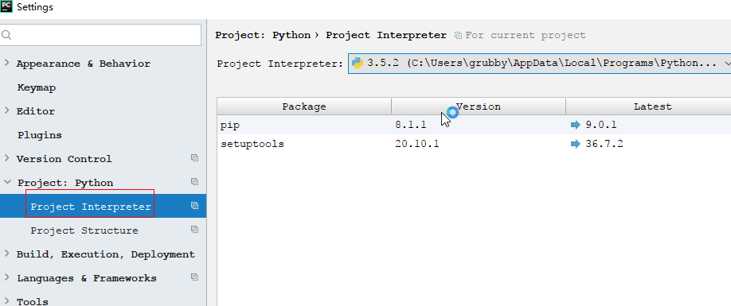
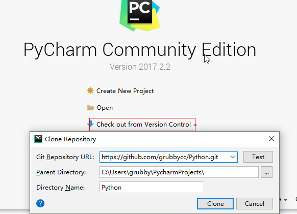
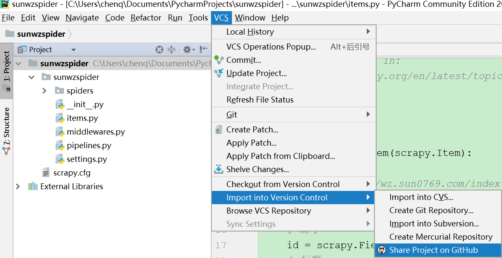
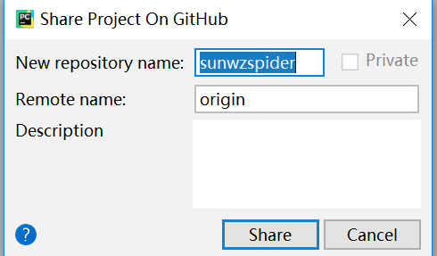
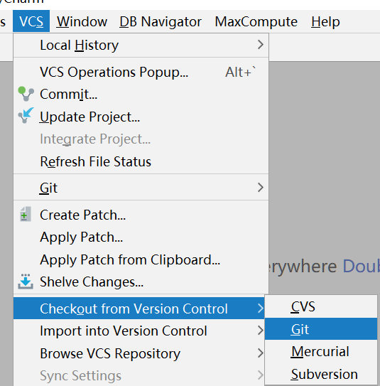
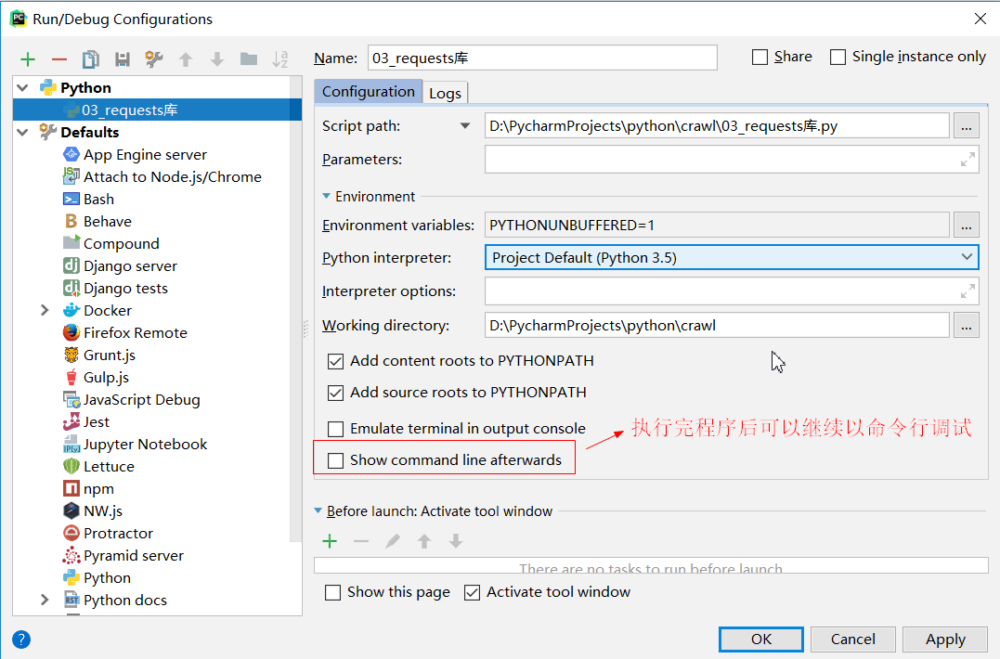
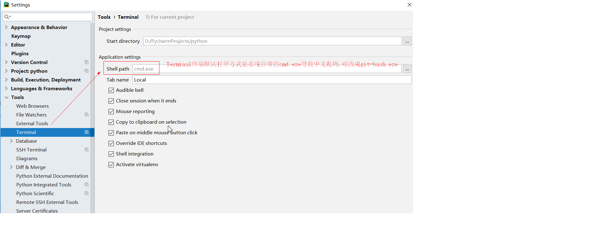

## tools
- [chrome无法添加应用、扩展程序和脚本](https://jingyan.baidu.com/article/f3ad7d0f09436709c3345b0b.html)
- [chrome安装谷歌访问助手](https://jingyan.baidu.com/article/7e440953191a2b2fc0e2ef0c.html)
- [chrome无法自动同步](https://post.smzdm.com/p/az59oog0/)
- [chrome安装谷歌访问助手程序包无效](https://blog.csdn.net/wst0717/article/details/88867047)
- [chrome固定到任务栏后点击出现两个图标](https://blog.csdn.net/qq_26012495/article/details/80814758)
- [chrome请停用以开发者模式运行的扩展程序](https://www.cnblogs.com/bky-zhwtt123/p/12671565.html)
- [github下载速度缓慢](https://www.jianshu.com/p/0493dcc15d6f)
- [fiddler设置只代理部分浏览器](https://segmentfault.com/q/1010000007944006)
- [fiddler手机数据抓包配置](https://www.cnblogs.com/qinyulin/articles/6843829.html)
- [fiddler设置代理后iphone有些app打不开](https://www.cnblogs.com/KK3228911/archive/2018/11/01/9890211.html)
- [jupyter代码自动补全](https://www.cnblogs.com/qiuxirufeng/p/9609031.html)
- [windows安装redis](https://www.jianshu.com/p/e16d23e358c0)
- [JetBrains全系列软件(插件)激活码](https://www.fuocu.cn/archives/jetbrains-crack/)
- [pycharm专业版永久激活](https://blog.csdn.net/weixin_39332299/article/details/79692283)
- [pycharm远程连接服务器调试代码](https://www.jianshu.com/p/79df9ac88e96)
- [pycharm删除项目](http://blog.csdn.net/xiaohukun/article/details/75077049)
- [pycharm导入外部模块](https://jingyan.baidu.com/article/93f9803f5dababe0e46f55fc.html)
- [pycharm安装black代码格式化](https://blog.csdn.net/u011510825/article/details/82287022)
- [tableau10.5破解版安装](https://www.jianshu.com/p/ec54bb870065)
- [激活windows转到电脑设置以激活windows](https://jingyan.baidu.com/article/22fe7cedff25cc3002617fe0.html)
#### 配置settings
  
- pycharm可以export/import默认配置模板(字体、样式等)
#### 配置Github  
  
  
#### 配置Interpreter  
 
#### check out 
  
#### import into  

 
#### 公司一般用gitlab  
  
#### pycharm运行程序console设置  

#### pycharm终端terminal乱码

